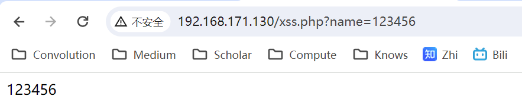
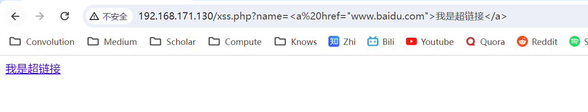
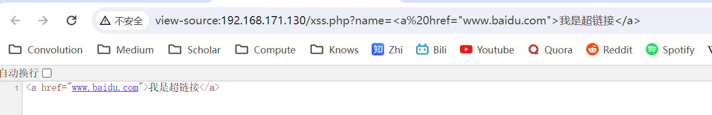
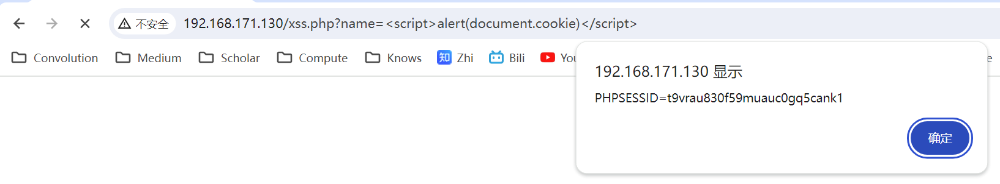

# XSS注入

## 一、XSS概述

​	XSS漏洞，全称跨站脚本（Cross-Site Scripting）漏洞。是一种常见的网络应用程序安全漏洞。XSS漏洞允许攻击者将恶意脚本代码注入到正常的网页中，当其他用户浏览这些被注入了恶意脚本的页面时，就会执行这些脚本。这些恶意脚本可以用来盗取用户的敏感信息（如cookies、会话令牌等）、篡改网页内容、进行钓鱼攻击以及利用客户端硬件资源实施挖矿行为等。

> 提示：如果访问某些小H站时，手机发热严重，流量飞逝，且页面明显卡顿，很有可能是该页面嵌入了挖矿脚本。

​	XSS漏洞的出现往往是因为Web程序没有正确地处理校验用户的输入，使得攻击者能在网页端内嵌并执行非预期的JavaScript或其他脚本语言的攻击脚本。一个最简单的例子，当Web程序没有校验而直接输出用户输入的数据时，就会有XSS漏洞。例如：

```php
<?php 
session_start();
$name = isset($_GET['name']) ? $_GET['name'] : '';
echo $name;
?>
```

​	对于这个脚本，Web程序会将用户的输入不经任何处理，直接输出到Web页面：



​	假如用户输入了一个html的标签，也会被直接渲染到页面：



​	查看源代码：

	

​	如上，假如点击该超链接就会跳转到百度。由上可知，假如不对用户输入加以限制，Web程序会将用户输入的携带html标签的字符串解释为html页面的一部分。因此如果用户输入一段获取cookie的JS脚本，也会被浏览器正常解析执行：



## 二、XSS类别

​	XSS根据其注入方式的不同，主要分为三类：反射型XSS，存储型XSS，DOM型XSS。

### 1、反射型

​	上面所举得例子就是一个反射型XSS。反射型XSS最大的特点就是，攻击者往往需要构建特定的URL，往往会包含恶意JS代码，并且需要受害者点击该URL才会生效。当受害者点击了恶意URL之后，恶意代码会被发送到目标网站服务器上，但是服务器并不会将这段代码进行存储，而是将这段代码‘反射’给受害者的浏览器，并在受害者浏览器中执行，从而达到攻击目的。这种攻击方式需要用户的交互才能成功。

​	反射型XSS攻击可以用于盗取用户的会话Cookie、劫持用户会话、重定向到恶意网站、甚至在用户浏览器中执行任意JS代码。危害性很高。

#### 	**反射型的XSS有以下特点：**

+ 反射型XSS攻击是一次性的，必须要用户点击携带恶意代码的链接才能发起。
+ 反射型XSS的payload往往会直接展示在URL中，隐蔽性不强。
+ 顾名思义，反射型XSS是将恶意代码反射给客户端浏览器，并不会直接威胁到服务端安全。

#### 	**反射型XSS防御方法**

**输入验证**

- **验证所有输入：** 对所有用户输入进行验证，确保输入符合预期的格式。不信任任何来自用户的数据，包括查询字符串、表单数据、cookie等。
- **使用白名单：** 对于预期的输入，应用白名单验证，只允许通过特定的、预定义的输入，而不是尝试检测和拦截恶意输入。

**输出编码**

- **适当的输出编码：** 在将用户控制的输入插入到HTML页面中时，应该对其进行HTML编码，以确保这些数据被安全地呈现，而不是作为代码执行。这涉及将特殊字符转换为HTML实体。
- **编码动态内容：** 特别注意脚本、HTML属性、URL等动态生成的内容的编码，确保这些内容在插入到页面中时不会被解释执行。

**使用内容安全策略（CSP**）

- **实施CSP：** 通过设置内容安全策略（CSP），限制网页上可以加载和执行的资源。例如，可以限制只允许执行自己网站域名下的脚本，防止恶意脚本执行。

**其他安全措施**

- **使用HTTPS：** 通过使用HTTPS来保护所有的页面，你可以减少中间人攻击的机会，这些攻击可能修改网页内容以注入恶意脚本。
- **设置HTTPOnly和Secure标志的Cookies：** 为敏感cookies设置HTTPOnly标志，使得JavaScript无法读取这些cookies。对于需要通过HTTPS传输的cookie，设置Secure标志。
- **使用现代Web框架和库：** 现代Web框架和库（如React, Angular, Vue等）通常提供了自动的XSS防护措施，通过自动转义HTML输出来减少XSS攻击的风险。

### 2、存储型XSS

​	存储型XSS（也称为持久性XSS）是一种跨站脚本攻击，其中恶意脚本被永久存储在目标服务器上，例如在数据库、消息论坛、访客留言板、评论区等。当其他用户访问了包含恶意脚本的页面时，这段脚本会在他们的浏览器中执行。这种攻击方式特别危险，因为它不需要受害者主动点击链接或进行特定操作，只需访问受感染的页面即可。比起反射型XSS，注入型XSS最危险的一点就在于，它的攻击效果是持久化的。

#### 存储型XSS的工作流程

1. **攻击者准备恶意脚本：** 攻击者创建一个包含恶意JavaScript代码的输入，如一个带有脚本的评论。
2. **提交恶意脚本到目标网站：** 攻击者将这个包含恶意脚本的输入提交到目标网站的一个存储点，如评论区、论坛帖子或用户资料页。
3. **网站存储恶意脚本：** 目标网站接收输入并将其存储在服务器上，没有充分清理或转义输入内容。
4. **受害者访问受影响的页面：** 当其他用户访问含有恶意脚本的页面时，该脚本在他们的浏览器中执行。
5. **执行恶意脚本：** 恶意脚本在受害者浏览器中执行，可能导致敏感信息泄露、会话劫持、恶意重定向等攻击。

#### 存储型XSS的防御策略

- **输入验证：** 对所有输入数据进行严格验证，拒绝包含恶意内容的输入。在处理需要存储的用户数据时，将其转换为HTML实义编码再进行存储。
- **输出编码：** 在将用户输入的数据呈现给浏览器之前，对其进行适当的HTML编码，以确保浏览器将其视为数据而不是可执行的代码。
- **使用HTTP Only Cookie：** 设置敏感cookies为`HTTPOnly`，这样即使攻击者能够通过XSS注入脚本，也无法通过JavaScript访问这些cookies。
- **内容安全策略（CSP）：** 实施CSP可以限制网页上可以执行的脚本来源，从而防止恶意脚本的执行。
- **安全框架：** 使用各种现代Web框架提供的自动化XSS防御措施，如自动转义模板系统。

### 3、DOM型XSS