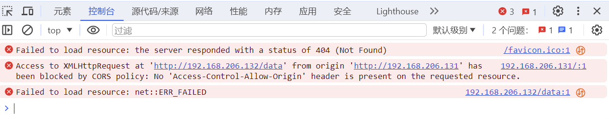

# 同源策略------Same-Origin Policy

### 一、同源策略概述

​	**同源策略(Same-Origin Policy)**是一个浏览器实施的安全策略，它用于限制一个源（origin）的文档或脚本如何与另一个源的资源进行交互。在同源策略下，如果两个页面有**相同的协议**（例如都是HTTP或HTTPS）、**主机名**（域名 ）和**端口号**，它们就被认定为“同源”。例如：`http://www.example.com/app1`和`http://www.example.com/app2`是同源，而`http://static.example.com`和`http://www.example.com`由于子域名不同，则被认定为不同源。

​	同源的网站之间可以相互读取文档和脚本，而不同源的网站之间，如果不加条件，则一般不允许相互读取文档和脚本。注意，这里的不允许**是浏览器行为，不是服务器行为**。同源策略是**浏览器的安全策略**。

​	不同源的网站之间虽然不能读取文档和脚本，但是可以执行代码脚本或者写数据。也就是说，对于同源策略而言，不同站点间的访问权限为W+X，即：可写，可执行，但不可读。

​	下面举个例子深入研究同源策略。

### 二、验证同源策略

##### 1> 实验环境：

+ Server1：192.168.206.131；
+ Server2：192.168.206.132；

##### 2> 实验内容：

在Ser1上添加一个HTML页面，用来向Ser2发起请求，来读取HTML文档资源：

```html
<html>
<head>
    <title>Server 1</title>
    <script>
        function makeRequest() {
            var xhr = new XMLHttpRequest();
            xhr.open('GET', 'http://192.168.206.132:80', true);
            xhr.onreadystatechange = function() {
                if (xhr.readyState == 4 && xhr.status == 200) {
                    alert('Response from server 2: ' + xhr.responseText);
                }
            };
            xhr.send();
        }
    </script>
</head>
<body>
    <h1>This is Server 1</h1>
    <button onclick="makeRequest()">Request Data from Server 2</button>
</body>
</html>
```

这样就实现了一次跨域请求。点击`button`，打开控制台监听状态，会发现浏览器拦截了请求：



其中第二条错误就是被同源策略拦截的提示

```http
Access to XMLHttpRequest at 'http://192.168.206.132/data' from origin 'http://192.168.206.131' has been blocked by CORS policy: No 'Access-Control-Allow-Origin' header is present on the requested resource.

错误消息中提到的`CORS Policy`是跨源资源共享策略，是对同源策略的一种补充，允许不同源的站点之间安全的传递数据，后面还会讲到。
```

查看非同源的跨域请求的http报头会发现多了一个字段：`Origin`

```http
GET / HTTP/1.1
Accept: */*
Accept-Encoding: gzip, deflate
Accept-Language: zh-CN,zh;q=0.9
Cache-Control: no-cache
Connection: keep-alive
Host: 192.168.206.132
Origin: http://192.168.206.131
Pragma: no-cache
Referer: http://192.168.206.131/
User-Agent: Mozilla/5.0 (Windows NT 10.0; Win64; x64) AppleWebKit/537.36 (KHTML, like Gecko) Chrome/120.0.0.0 Safari/537.36

在处理跨源请求时，浏览器会自动添加Origin字段到HTTP请求头中，用以标识发起请求的网页的源信息，包括协议、域名和端口。服务器接收到请求后，将根据其CORS策略检查这个Origin。CORS策略决定了是否允许这个跨源请求。如果服务器的响应中包含了匹配该Origin的Access-Control-Allow-Origin字段，或者字段值为*（代表接受任何源），则浏览器将允许请求继续。否则，浏览器将执行同源策略，阻止对该资源的访问。需要注意的是，同源策略的执行是由浏览器完成的，而不是服务器。
```

### 三、总结

在上述实验中，当服务器1（Ser1）向服务器2（Ser2）发送跨域请求时，由于同源策略，这种不同源站点间的请求被浏览器拦截，并显示错误。这种做法在防止跨站脚本攻击（XSS）和跨站请求伪造（CSRF）等网络攻击方面发挥了重要作用。然而，同源策略也限制了不同源站点之间的交互，这在实际的生产环境中往往是必需的。为了解决这一问题，开发了如CORS等跨域请求技术，使得在保持安全的同时，不同源的站点能够互相请求数据。

> 跨域请求请前往[跨域请求.md](跨域请求.md)

**注意！有六个标签是不受同源策略影响的，它们分别是：**

+ \<script\>   

  ​	用于加载JavaScript脚本。这个标签不受同源策略限制是因为脚本经常从CDN（内容分发网络）等外部源加载，而这些外部源通常与脚本所在的网站不同源。如果<script>标签受到同源策略的限制，那么许多网站将无法使用CDN或外部库。

+ \    

  ​	用于嵌入图像。图像标签``可以从任何地方加载图像资源，这对于网站来说是必要的，因为图像资源常常存储在与网页服务器不同的服务器上。

+ \<link\>    

  ​	用于引入CSS文件。CSS样式表通常由不同的源提供，特别是在使用在线字体或样式框架时。

+ \<iframe\>

  ​	用于嵌入另一个HTML页面。虽然`<iframe>`可以加载任何来源的页面，但嵌入的内容是隔离的，不能直接操作父页面的DOM，这是一种安全措施。

+ \<video\> 和 \<audio\>

  ​	用于嵌入视频和音频内容。这些标签允许网页从不同的源加载媒体文件。
