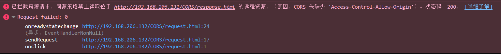
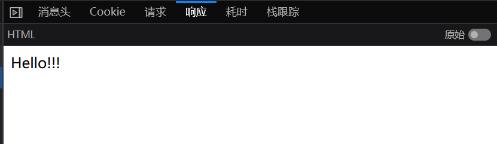
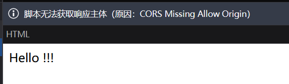

# 跨域请求

## 一、跨域请求详解

### 	1 > 什么是跨域请求？

​		跨域请求是 Web 开发中的一个常见概念，它涉及到从一个域名向另一个域名发起的网络请求。在浏览	器中，跨域请求主要	是由于同源策略的限制。同源策略是一种安全协议，它要求两个进行交互的页面必须拥有相同的协议（例如，HTTP 或 HTTPS）、域	名和端口号。如果请求不满足这些条件，它就被视为跨域请求。

### 	2 > 为什么需要跨域请求？

​		**1、资源共享：**Web 应用程序可能需要从不同的源访问资源，比如从不同的域加载图片、样式表、脚本或视频。

​		**2、API集成：**现代 Web 应用经常使用来自多个源的 API，如社交媒体、地图服务或广告服务。

​		**3、模块化和分布式服务：**大型应用可能会将不同的服务部署在不同的域上，以提高模块化和维护性。

​		**4、安全性和性能：**跨域请求有助于在保持安全性的同时实现服务的优化和负载平衡。

​		**跨域问题是 Web 安全和网络开发中的重要部分，理解和妥善处理跨域请求对于创建功能丰富且安全的 	Web 应用至关重要。**

### 	3 > 跨域请求的种类

​		**1 >> 简单请求（Simple Requests）：**

​			1、 发送请求使用`GET`、`HEAD`或`POST`方法。

​			2、 发送的`POST`请求的内容类型只能是 `application/x-www-form-urlencoded`、multipart/form-data` 或 `text/plain`。

​			3、 不会对服务器造成重大影响。

​			4、 浏览器会直接发送这类请求，但如果请求的回应不包含适当的CORS（跨域资源共享）头部信息，浏览器会拒绝应用程		序访问响应。

​		**2 >> 预检请求（Preflighted Requests）:**

​			1、 使用 `OPTIONS` 方法发起的一个预请求（preflight request），用于验证实际请求是否安全。

​			2、 适用于使用 `PUT`、`DELETE`、`CONNECT`、`OPTIONS`、`TRACE`、`PATCH` 等 HTTP 方法的请求，或者使用了除简单请求之		外的 HTTP 头部信息的请求。

​			3、 这种请求首先发送一个预检请求到服务器，询问是否可以发送实际的请求。

​		**3 >> 带凭证的请求（Requests with Credentials）:**

​			1、 默认情况下，跨域请求不会发送任何凭证（如 cookies 和 HTTP 认证相关数据）。

​			2、 如果要在跨域请求中发送凭证，必须在 XHR 对象上设置 `withCredentials` 属性。

---


## 二、跨域请求的方法


### 	1 >  跨域DOM互访问

​		跨域DOM一般是前端不同源的页面互相访问彼此的DOM资源，与服务器无关。是前端页面的数据交互。跨域DOM互访问的方	法有：设置`document.domain`属性、`window.name`跨域以及`window.postMessage`方案。

#### 			1 >> 设置`document.domain`属性

​		`document.domain`是`Javascript`中的一个属性，用于获取或设置当前文档的域名。在默认情况下，由于同源策略的限制，不	同子域下的页面不能相互访问DOM。但是如果这些页面的`document.domain`设置为相同的值（即它们拥有共同的顶级域名），浏览	器就会认为它们是同源，从而允许相互通信。

```javascript
document.domain = "example.com";
// 在每个页面的JS代码中添加此代码，修改属性。
```

​		**在使用`document.domain`属性的时候有两点需要注意**

​		1、修改`document.domain`时，浏览器会做安全检查，只允许将其修改为当前域名，或者父域名，否则会抛出异常。

```javascript
// 例如：你有一个页面来自`subdomain.example.com`
// 另一个页面来自`another.example.com`
// 你可以将两者的document.domain都设置为example.com
document.domain = "example.com";
// 但是不能将another.example.com的属性设置为subdomain.example.com或者其他域名。
```

​		因此，攻击者无法利用该属性实施恶意脚本攻击。因为攻击者没有服务器的域名或子域名。

​		2、修改`document.domain`的同时会把当前的端口设置为`null`。也就是说，同一个域名下，无论web应用运行在哪一个端口，	只要设置了`document.domain`属性，都会变成同源。也就是说`document.domain`舍弃了同源策略中对端口的限制。也正因如此，一	个设置了`document.domain`属性的页面和没有设置该属性的页面是不可能同源的，因为端口一定是不同的。

#### 2 >> 通过`window.name`跨域

​		通过设置`window.name`跨域是一个很巧妙的方法。`window.name`原本是JS中的一个全局属性，用于表示窗口名称。但`window.name`的一些特性使其成为了跨域请求的一个方法。

​		**1、数据持久性：**`window.name` 在同一个浏览器窗口或标签页的不同页面加载过程中保持不变，即使页面从一个域（例如：`domainA.com`）导航到另一个完全不同的域（例如：`domainB.com`）。例如，如果 	`domainA.com` 的 `indexA.html` 页面设置了 `window.name` 属性，随后 `domainB.com` 的 `indexB.html` 页面	使用 `iframe` 标签加载了 `domainA.com` 的 `indexA.html`，则此时 `iframe` 中加载的页面的 `window.name` 	会被设置为 `indexA.html` 中的 `window.name` 的值。

​		此时，直接从 `indexB.html` 读取 `<iframe>` 中的 `window.name` 值是不行的，因为这被视为跨域请求，	同源策略限制了这种访问。然而，由于 `window.name` 属性具有持久性，当 `indexA.html` 页面使用JS 修改 	`<iframe>` 中的 `src` 值指向同源页面时，`window.name` 的值会被保留下来。此时，请求变成了同源请求，	因此可以在新加载的同源页面中访问 `window.name` 的值。

```html
<!-- 例如这个代码，假设它是indexB.html -->
<!DOCTYPE html>
<html lang="en">
<head>
  <meta charset="UTF-8">
  <meta name="viewport" content="width=device-width, initial-scale=1.0">
  <title>Document</title>
</head>
<body>
  <iframe id="myIframe" src="http://192.168.206.131/indexA.html" style="display:none;"></iframe>
  <script>
    var iframe = document.getElementById("myIframe");
    iframe.onload = function(){
     	iframe.src = "http://192.168.206.132/intermediate.html"; // 修改src为同源页面。
    };
      
    // var window_name = document.getElementById("myIframe").contentWindow.name;
    // console.log(window_name);
    // alert(window_name);
    // 直接访问<iframe>中的window.name的值会被阻挡，返回空值。
  </script>
</body>
</html>
```

​		**2、存储能力：**除了上述的数据持久性以外，一个用于设置窗口名称的属性居然可以存储数MB的数据，	也正因如此，该属性可以用于页面间传递信息。

---

> ​	**注意点**：`window.name` 是 `window` 对象的一个属性，它在整个浏览器窗口或标签页的生命周期中保持不变，即使页面导航发生改变。这意味着，无论页面如何在不同的域间跳转，`window.name` 保持其赋值状态。`<iframe>` 标签能够加载并显示另一个 HTML 页面，且每个 `<iframe>` 拥有自己的 `window` 对象和文档对象模型（DOM）。因此，它可以独立于父页面运行，并且每个 `<iframe>` 都有自己的 `window.name` 属性。
>
> 这样的结合提供了一种独特的方式来实现跨域通信。当一个 `<iframe>` 从一个源（例如 domainA.com）加载页面，并随后导航到另一个源（例如 domainB.com），`<iframe>` 中的 `window.name` 保持之前页面的值不变。因此，即使 `<iframe>` 加载了不同源的页面，通过 `window.name` 也可以传递数据，实现跨域通信。这是其他 HTML 标签所不具备的能力。

---

#### 3 >> window.postMessage方案


### 2 > 跨域访问服务端

​	DOM文档间跨域互访问本质是一个前端页面获取一个不同源的前端页面的过程，而当前端页面需要从跨域的服务端请求数据时，则需要用到服务端的跨域访问方法。服务端跨域一般有三种方法：**`JSONP`方案（JSON with Padding）**、**`CORS`跨域资源共享（Cross-Origin-Resource-Sharing）**以及**`WebScoket`跨域访问**

#### 1 >> `JSONP`方案

​	JSONP（JSON with Padding）也是一种实现跨域请求或数据交换的技术。由于路由器的同源策略限制了从一个源向另一个源发起的`XMLHttpRequest`请求，因此JSONP提供了一种绕过这些限制的方式。


​	**原理：**

​		**1、利用`<script>`标签：**在同源策略中提到，一些HTML标签不受同源策略的影响，`<script>`就是	其中之一。这意味着，可以通过`<script>`标签加载不同源的JavaScript代码。

​		**2、回调函数：** JSONP的“P”代表“Padding”（或“前缀”），通常是一个函数调用。服务端响应不是纯粹	的JSON数据，而是一个函数调用，其参数是JSON数据。


​	**示例：**

​		**1、客户端代码：**

```html
<!DOCTYPE html>
<html lang="en">
<head>
    <meta charset="UTF-8">
    <meta name="viewport" content="width=device-width, initial-scale=1.0">
    <title>Document</title>
</head>
<body>
    <script>
        function test(data){
            console.log("Received data: " + JSON.stringify(data));
        }
    </script>
    <script src="http://192.168.206.131/jsonp.php?callback=test"></script>
</body>
</html>

// 客户端利用<script>标签发请求，带上callback参数。这个回调函数需要是JS脚本预先定义好的函数名。
```

> 注意：客户端使用的是<script>标签请求数据，而<script>标签请求外部JS代码是不受同源策略限制的。所以需要注意的是，这个<script>请求获得的数据本质是JS代码。

​		**2、服务端代码：**

```php
<?php
    $data = array( // 定义一个数组
        'name' => 'John',
        'age' => 25,
        'city' => 'New York'
    );

    if (isset($_GET['callback'])) { // 判断是否有回调函数参数
        header('Content-Type: text/javascript');
        echo $_GET['callback'] . '(' . json_encode($data) . ');'; // 将数组序列化为json字符串。拼接回调函数，使其成为JS代码。
    } else {
        header('Content-Type: application/x-json');
        echo json_encode($data);
    }
```

>注意第10行代码，这一段拼接了一段JS代码，并将其响应给前端。
>例如： 假设前端发起的请求为："http://192.168.206.131/jsonp.php?callback=alert"
>后端响应的值为：JSON。那么后端代码会响应拼接为如下内容：

```javascript
// 由于这一段 'echo $_GET['callback'] . '(' . json_encode($data) . ');';''
// 因此响应被拼接为：
alert("JSON")
```

> 因此，这段后端代码返回值其实是一段JS代码。也正因如此，即符合<script>请求数据的格式，同时绕过了同源策略的限制。


​	**缺点**

​		**1、安全问题：**JSONP有潜在的安全风险，因为它允许执行来自第三方服务器的脚本。如果第三方服务器	不可信，这可能导致跨站脚本攻击（XSS）。

​		**2、请求方法限制为GET：**JSONP仅支持GET请求，这限制了它的用途，尤其是对于需要POST、PUT、	DELETE等HTTP方法的应用。

​		**3、错误处理不足：**与XMLHttpRequest或Fetch API相比，JSONP在错误处理方面提供的支持较少。


​	**总结**

​		由于上述各种缺点，JSONP仅可作为跨源方案的一种，但不被大规模使用，因为有更好的替代方案：	CORS。CORS在各方面都比JSONP要跟适合在跨域请求的时候使用，因为其就是为跨域请求设计的。


#### 2 >> `CORS`跨域资源共享

​		**概述：**CORS（Cross-Origin Resource Sharing 跨源资源共享，通俗译为跨域资源共享）是一种基于	HTTP头的机制，该机制通过允许服务器标识除了它自己以外的其他源，使得浏览器允许这些源访问加载自己	的资源。跨源资源共享还通过一种机制来检查服务器是否会允许要发送的真实请求，该机制通过浏览器发起	一个到服务器托管的跨源资源的“预检”请求。在预检中，浏览器发送的头中标示有 HTTP 方法和真实请求中会	用到的头。预检请求（preflight request）在后面还会讲到。


​		**CORS应用场景：**

​			在下面的场景中需要CORS策略来确保资源安全共享。

​			**1、由`XMLHttpRequest`或`Fetch API`发起的跨源HTTP请求：**当一个网页尝试使用JavaScript脚本		发送一个数据请求（通过`XMLHttpRequest`或`Fetch API`）的时候，会涉及到CORS。如果目标服务器没		有通过CORS头部明确允许跨源请求，浏览器将阻止这些请求。

​			**2、Web字体（通过 @font-face 使用跨源字体资源）：**网站设计中经常会用到来自其他源的字体文		件。为了在CSS中使用这些跨源字体资源（如TrueType字体），需要目标服务器支持CORS，允许字体资		源的跨源使用。

​			**3、WebGL贴图：**在使用WebGL进行3D渲染时，可能需要加载来自其他源的贴图（纹理）。这同样		需要目标服务器通过CORS允许跨源访问。

​			**4、使用 `drawImage() `将图片或视频画面绘制到 canvas：**当使用HTML的 `<canvas>` 元素绘制来		自不同源的图像或视频时（例如，使用 `drawImage()` 方法），CORS同样是必要的。如果图像或视频源		没有正确的CORS响应头，浏览器会限制对这些资源的访问，以避免安全问题，如跨站脚本攻击。

​			**5、来自图像的 CSS 图形：**CSS可以使用来自不同源的图像作为图形装饰（例如，背景图片）。如果		这些图像资源没有适当的CORS设置，它们可能无法在网页上正确显示。

---

> ​			由于不考虑前端开发，所以本文主要讨论第一种使用场景，即复杂请求与CORS相关。

---

​		**哪些请求场景可以不需要CORS：**

​			**1、简单请求（simple request）：**简单请求是跨源请求的一种，其特点是不会触发CORS。一个		HTTP请求如何被视为简单请求后面会讲到。

​			**2、从脚本中加载资源：**当Web页面从其他源加载脚本（如`<script src="...">`）时，这些请求不		受CORS限制。前面提到`<script>`标签不受同源策略的限制，更不用说是专门为了克服同源策略的CORS		了。这样做允许从CDN等外部源加载库和框架。

​			**3、样式表和媒体资源：**同上，`<link>`标签或`@import`从其他源加载CSS样式表也不受同源策略和		CORS影响。类似的还有``、`<vidio>`以及`<audio>`等标签也可以跨源加载，不需要CORS。

​			**4、其他嵌入的资源：**通过`<iframe>`嵌入的页面，通过`<obiect>`、`<embed>`和`<applet>`嵌入的资		源同样不需要CORS。

​			**5、Public APIs：**公开的API（数据接口）如果设计为可以被跨域请求，则一般会主动设置CORS头		部以允许任何来源的请求，这种情况也不需要客户端设置CORS。


​		**功能概述**

​			CORS新增了一组HTTP标头字段，允许服务器声明哪些源站通过浏览器有权限访问哪些资源。另		外，规范要求对那些可能对服务器数据产生副作用的HTTP请求方法（特别是GET以外的HTTP请求），浏		览器必须首先使用`OPTIONS`方法发起一个预检请求（preflight request），从而获知服务端是否允许该		跨源请求。服务器确认请求之后，才发起实际的HTTP请求。在预检请求的返回中，服务器端也可以通知		客户端，是否需要携带身份凭证（例如Cookie和HTTP认证相关数据）。

​			CORS请求失败会产生错误，但是为了安全，在JavaScript代码层面无法获知具体问题，只能查看浏		览器控制台。


​		**访问控制场景**

​			通过三个场景来演示跨源资源共享机制的工作原理。

​		**1 >>> 简单请求：**

​			上面提到简单请求不会触发CORS预检机制，不需要发送一个`HTTP OPTIONS`情求来询问服务器是否		允许跨源访问。那么如何判断一个HTTP请求是否是简单请求呢？根据官方文档，若请求满足所有下述条		件**（注意是所有条件）**，则该请求可视为简单请求：

​			**1、请求方法：**简单请求必须是`GET`、`HEAD`或`POST`请求方法之一。

​			**2、允许的HTTP头部：**简单请求只能包含某些特定的HTTP头部。除了浏览器自动设置的标准头		部（如`Connection`、`User-Agent`）之外，只有以下几种头部被允许：

```http
-----------------------------------------
1、Accept: 告诉服务器客户端能够处理的内容类型
2、Accept-Language: 告诉服务器客户偏好的语言
3、Content-Language: 告诉服务器请求主体中使用的语言
4、Content-Type: 告诉服务器请求的主体的媒体类型
5、Range: 用于请求文档的部分内容（只允许简单的范围标头值，如`bytes=256-`）
```

​			**3、Content-Type标头的媒体类型：**当使用POST方法时，`Content-Type`头部的值被限制为以		下三种之一：

```http
-----------------------------------------
1、text/plain: 纯文本格式
2、multipart/form-data: 用于文件上传，与HTML表单中的`enctype`属性值相同。
3、application/x-www-form-urlencoded: 标准的编码格式，与HTML表单的默认类型相同
```

​			**4、`XMLHttpRequest`上传监听器：**如果请求是使用 [`XMLHttpRequest`](https://developer.mozilla.org/zh-CN/docs/Web/API/XMLHttpRequest) 对象发出的，在返回的 		`XMLHttpRequest.upload` 对象属性上没有注册任何事件监听器；也就是说，给定`XMLHttpRequest` 实		例 `xhr`，没有调用 `xhr.upload.addEventListener()`，以监听该上传请求。

​			**5、没有使用`ReadableStream`对象：**

​				`ReadableStream`对象是一种可以用来读取数据流的Web API。它们常用于处理大型数据集或			者需要按块读取的数据，例如视频流或大型文件。

​			在简单请求中，你不能使用`ReadableStream`对象发送数据。这是因为使用数据流意味着请求			可能涉及大量数据的连续传输，这超出了简单请求的范围。

​			简单请求通常包含更静态的数据负载，如字符串或JSON对象，而不是连续流动的数据。因此，如果			一个请求使用了`ReadableStream`对象，它就会被视为非简单请求，可能需要进行CORS预检。

> 注意：一个HTTP请求只有同时满足上述五个条件，才能成为简单请求。任何一个条件不满足都将触发CORS的预检机制，成为预检请求。这些条件共同作用于确保请求不涉及复杂的数据类型或交互方式，从而满足Web的跨源请求安全策略。简单请求只是不会触发CORS的预检机制，但仍然受同源策略的约束。

​		**验证简单请求**

​		在客户端 http://192.168.206.132/CORS/request.html 页面向服务端发起请求

```html
<!-- http://192.168.206.132/CORS/request.html -->
<!DOCTYPE html>
<html lang="en">
<head>
    <meta charset="UTF-8">
    <meta name="viewport" content="width=device-width, initial-scale=1.0">
    <title>Document</title>
</head>
<body>
    <button onclick="sendRequest()">Click</button>
    <script>
        function sendRequest() {
            const xhr = new XMLHttpRequest();
            const url = "http://192.168.206.131/CORS/response.php";
            // 定义当请求状态变化时的处理函数
            xhr.onreadystatechange = function() {
                // 检查请求是否完成（状态4）且成功（状态码200）
                if (xhr.readyState === 4 && xhr.status === 200) {
                    // 这里处理请求成功的情况
                    console.log(xhr.responseText);
                } else if (xhr.readyState === 4) {
                    // 这里处理请求失败的情况
                    console.error("Request failed: " + xhr.status);
                }
            };
            // 配置GET请求
            xhr.open("GET", url);
            // 发送请求
            xhr.send();
        }
    </script>
</body>
</html>

```

> 这个代码使用`XMLHttpRequest`对象发送GET请求，属于简单请求。

​		点击发送按钮，观察HTTP请求头：

```http
GET /CORS/response.php HTTP/1.1
Host: 192.168.206.131
User-Agent: Mozilla/5.0 (Windows NT 10.0; Win64; x64; rv:121.0) Gecko/20100101 Firefox/121.0
Accept: */*
Accept-Language: zh-CN,zh;q=0.8,zh-TW;q=0.7,zh-HK;q=0.5,en-US;q=0.3,en;q=0.2
Accept-Encoding: gzip, deflate
Origin: http://192.168.206.132			# Origin字段表明请求的来源
Connection: keep-alive
Referer: http://192.168.206.132/
Pragma: no-cache
Cache-Control: no-cache
```

​		这个请求被同源策略拦截了，查看控制台，看看为什么被拦截



​		浏览器提示，响应头里面没有`Access-Control-Allow-Origin`字段，看看响应头：

```http
HTTP/1.1 200 OK
Server: nginx/1.14.0 (Ubuntu)
Date: Mon, 15 Jan 2024 09:16:33 GMT
Content-Type: text/html; charset=UTF-8
Transfer-Encoding: chunked
Connection: keep-alive
Content-Encoding: gzip
```

​		确实没有这个字段，因此无法跨域请求数据，接下来在服务端http://192.168.206.131/CORS/response.php修改代码，添加`Access-Control-Allow-Origin`字段，并设置允许客户端访问：

```php
// http://192.168.206.131/CORS/response.php
<?php
header("Access-Control-Allow-Origin: *"); 	# 允许来自任何源的请求
header("Access-Control-Allow-Origin: http://192.168.206.132");	# 允许来自特定源的请求
echo "Hello!!!";
```

​		修改完成之后再看一下HTTP响应头：

```http
HTTP/1.1 200 OK
Server: nginx/1.14.0 (Ubuntu)
Date: Mon, 15 Jan 2024 09:08:37 GMT
Content-Type: text/html; charset=UTF-8
Transfer-Encoding: chunked
Connection: keep-alive
Access-Control-Allow-Origin: http://192.168.206.132  # 允许特定源请求数据
Content-Encoding: gzip
```

​		如此，客户端收到了响应：



​		**2 >>> 预检请求**

​			前面一直在讲预检请求，那么什么是预检请求呢？与简单请求不同，“需预检的请求”要求必须首先使		用`OPTIONS`方法发起一个预检请求到服务器，以获知服务器是否允许实际请求。而由于简单请求不用获		知服务器是否允许实际请求，因此，虽然同源策略阻挡了脚本获取跨源数据，但是数据还是响应到前端		了：



​			而如果是发送预检请求，服务器不允许跨域请求的话，则根本不会有数据被响应到前端。预检请求		的使用可以避免跨域请求对服务器的用户数据产生未预期的影响。

#### 3 >> `WebScoket`跨域访问

