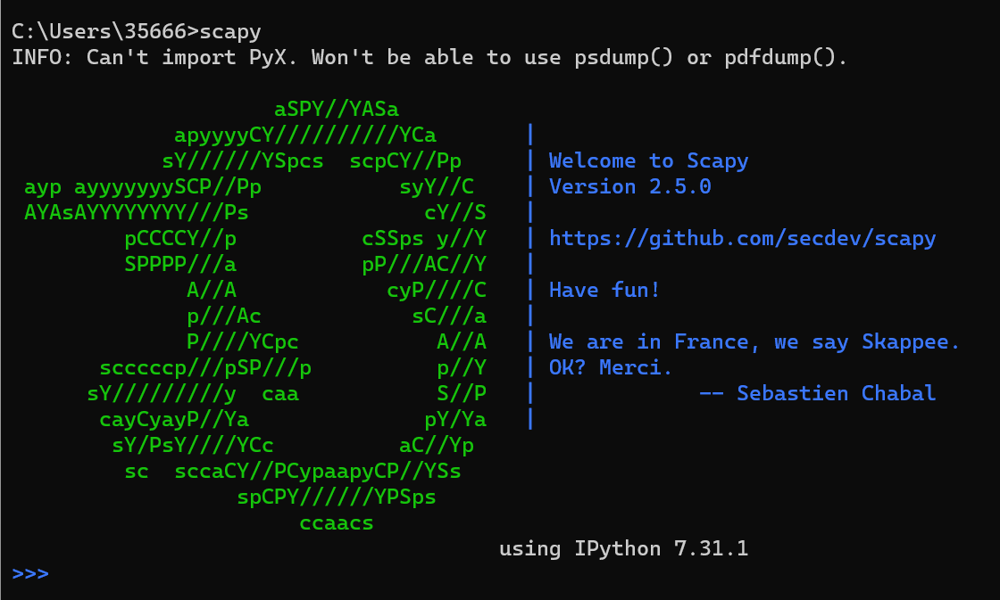

# Scapy笔记


## 一、scapy交互式操作：


### 1、运行scapy

​	首先将scapy.exe加入进环境变量，一般在python安装目录的script目录下。如果是anaconda，则在C盘的用户目录的appdate目录的python目录中的site-pakeges目录中。然后在命令行中输入scapy运行：



​	出现这样的画面就是运行成功了。

### 2、交互式操作

​	查看网卡信息：

```cmd
>>> show_interfaces()
```

​	监听网卡数据包，类似于wireshark：

```cmd
>>> sniff(count=5, iface="Intel(R) Wi-Fi 6E AX211 160MHz")
# count是监听数据包的个数，到达指定数据包个数则停止监听
# iface是具体监听哪张网卡
```

​	返回监听的数据包的类型和对应的个数：

```cmd
>>> sniff(count=5, iface="Intel(R) Wi-Fi 6E AX211 160MHz")
<Sniffed: TCP:1 UDP:1 ICMP:3 Other:0>
```


​	用变量接收数据包，并查看：

```cmd
>>> pkgs = sniff(count=5, iface="Intel(R) Wi-Fi 6E AX211 160MHz")
>>> pkg1 = pkgs[0]	# 通过索引的方式获取监听到的第一个报文
>>> pkg1.show()		#对pkg1调用show方法，展示报文
```

​	以上代码将返回监听到的报文的内容：

```cmd
###[ Ethernet ]###
  dst       = 22:37:a5:19:1f:ca
  src       = 22:37:a5:91:3b:64
  type      = IPv6
###[ IPv6 ]###
     version   = 6
     tc        = 104
     fl        = 890726
     plen      = 32
     nh        = TCP
     hlim      = 53
     src       = 240e:97c:2f::89
     dst       = 240e:45c:c10:a9ef:e5e0:9587:1cf5:61d5
###[ TCP ]###
        sport     = https
        dport     = 62903
        seq       = 135492317
        ack       = 4209133376
        dataofs   = 8
        reserved  = 0
        flags     = SA
        window    = 64800
        chksum    = 0xb71b
        urgptr    = 0
        options   = [('MSS', 1300), ('NOP', None), ('NOP', None), ('SAckOK', b''), ('NOP', None), ('WScale', 7)]
```

​	发送ICMP报文：

```cmd
>>> send(IP(dst="192.168.1.109")/ICMP()/data, inter=1, count=5)
# scapy编辑报文的格式是从左往右层数逐渐递增，如ICMP报文封装在IP报文之上，所以在IP协议的右边，以此类推。
# ICMP()是指定了报文协议类型，后面的参数分别是，ICMP报文中的数据字段data，发送间隔inter，以秒为单位，包的个数count。
# 假如将data字段的大小设置为ICMP支持的最大容量，count的个数设置为接近无限，则可以实现ICMP DDOS攻击。
```

​	接收ICMP报文响应：

```cmd
 >>> pkg = sr1(IP(dst="47.109.137.34")/ICMP())
 # 使用一个变量接收ICMP的响应报文，注意sr1方法中的 1 是数字 1 而不是字母l或I。
```

​	发送ARP报文：

```cmd
>>> send(ARP(psrc="192.168.1.109",pdst="192.168.1.1"))
# psrc为本机的IP地址，pdst为目的主机的IP地址
```

​	接收ARP响应报文：

```cmd
>>> pkg = sr1(ARP(psrc="192.168.1.109",pdst="192.168.1.1"))
Begin emission:
Finished sending 1 packets.
.*
Received 2 packets, got 1 answers, remaining 0 packets
>>> pkg.show()
###[ ARP ]###
  hwtype    = Ethernet (10Mb)
  ptype     = IPv4
  hwlen     = 6
  plen      = 4
  op        = is-at
  hwsrc     = b8:f8:83:f2:37:67
  psrc      = 192.168.1.1
  hwdst     = 7c:b5:66:9f:8e:59
  pdst      = 192.168.1.109
```


