# 内网穿透


​	在针对内网的渗透攻击中，由于内网环境相对封闭，且通常部署有出口网关或访问控制设备（如网络应用防火墙WAF和传统防火墙FW）等，攻击者即便成功进入内网，也可能因为端口的封闭和严格的访问控制，难以留下后门程序。然而，内网穿透技术的发展为攻击者提供了突破这些防御措施的手段。攻击者通过利用内网穿透技术，可以绕过防火墙或内网的限制，与外界建立TCP连接，不仅如此，通过利用一些特殊的协议（如VPN、SSH隧道等），还能实现数据的加密通信，或者利用反向代理，实现真实IP隐藏，从而增加了追踪和检测的难度。下面详细介绍以下常用的内网穿透技术。

​	**内网穿透技术主要用于绕过网络隔离或访问控制，实现从外部网络对内网资源的访问。这些技术可以分为几个主要类别：**

## 一、隧道技术

​	隧道技术是通过建立隧道协议（如SSH隧道、VPN、SSL/TLS隧道等）在内外网络之间创建一个加密的数据通道，这种方法可以有效地绕过网络访问控制，实现数据的隐秘传输。

​	一个非常经典的例子就是所谓的 “ 翻墙 ” 。“ 翻墙 ”的过程其实可以理解为一次大型的内网穿透，只不过这里的内网变成了中国互联网。而出口网关则是“GFW”（长城防火墙）。经过几十年的发展，GFW几乎成为了世界上最复杂、最广泛的互联网审查制度之一，但即便如此，还是有很多人通过一些内网穿透的手段成功绕过了GFW的限制，访问到了被屏蔽的国际互联网资源。这个过程中为了绕过GFW的监管，一般会采用数据加密，协议封装，以及代理服务器等多个技术，这也几乎是隧道技术的关键要素。

**隧道技术的关键要素：**

隧道技术涉及几个关键要素，使其能够有效地用于数据加密和隐蔽传输：

1. **加密**：隧道技术的核心在于其能够加密数据，确保数据在传输过程中的安全性和隐私。无论是SSH、VPN还是SSL/TLS隧道，它们都提供了强大的加密机制，使得数据即便被截获，也无法被第三方读取。
2. **协议封装**：隧道技术通常涉及将原始数据包装在另一个协议中，如在HTTP流量中封装VPN数据。这种封装方法使得隧道内的流量可以穿越网络防火墙和内容过滤系统，因为它们看起来像是正常的、被允许的流量。
3. **服务器中继**：大多数隧道技术都依赖于一个或多个中继服务器，这些服务器位于世界各地，帮助用户的数据绕过地理限制和审查。用户的数据首先被发送到这些中继服务器，然后才从服务器转发到最终目的地。

下面首先讲一下SSH隧道技术：

### 1、SSH隧道：

​	  SSH隧道（端口转发）是通过加密的SSH协议创建数据传输通道的技术。SSH隧道可以将任何基于TCP的流量通过SSH会话传输。建立SSH隧道的常用技术手段就是使用端口转发技术。端口转发又分为：本地端口转发、远程端口转发以及动态端口转发。

#### 本地端口转发：

  	本地端口转发是通过SSH隧道将本机上的某个端口的数据流量转发到远程服务器上的某个端口的技术。例如有如下场景：

```txt
攻击者：Kali-Linux	IP：192.168.171.135

服务器1：Ubuntu	IP1：192.168.171.136	IP2：1.1.1.1

服务器2：Ubuntu	IP：1.1.1.2
```

​	如上：服务器2开放一个web端口。攻击者的目标是访问服务器2上的web服务。可以看到，由于攻击者和服务器2不在同一网段，所以攻击者无法直接访问到服务器2的web服务。假设攻击者发现了一台既连接了外网，又连接了内网的服务器1，而服务器1可以访问到服务器2，并正好开启SSH服务。攻击者利用其漏洞拿下了其控制权，获得或修改其SSH密码或公私钥对，那么此时，攻击者就可以在自己的电脑上开启本地端口转发，以服务器1为中转服务器，建立一条与服务器2之间的SSH隧道。

​	攻击者在自己的计算机上运行指令：

```bash
ssh -N -L 8888:1.1.1.2:80 root@192.168.1.136

# -N表示不开启Shell连接
# -L表示开启本地转发
# 8888为本地端口
# 1.1.1.2:80为要访问的目标IP及端口
# root@192.168.1.136为用于建立连接的中转服务器
ssh -N-L <本地端口>:<目标主机>:<目标端口> <SSH用户名>@<中转服务器>
```

​	该指令运行完之后，攻击者只要访问`http://localhost:8888`就可以访问到服务器2的web服务。下面看实验效果：

​	首先，攻击者无法ping同服务器2，那么更加不会访问到web服务。

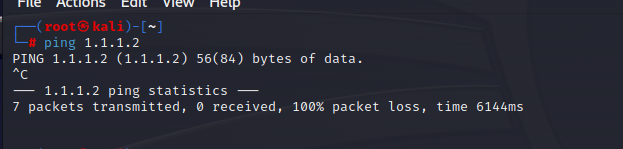

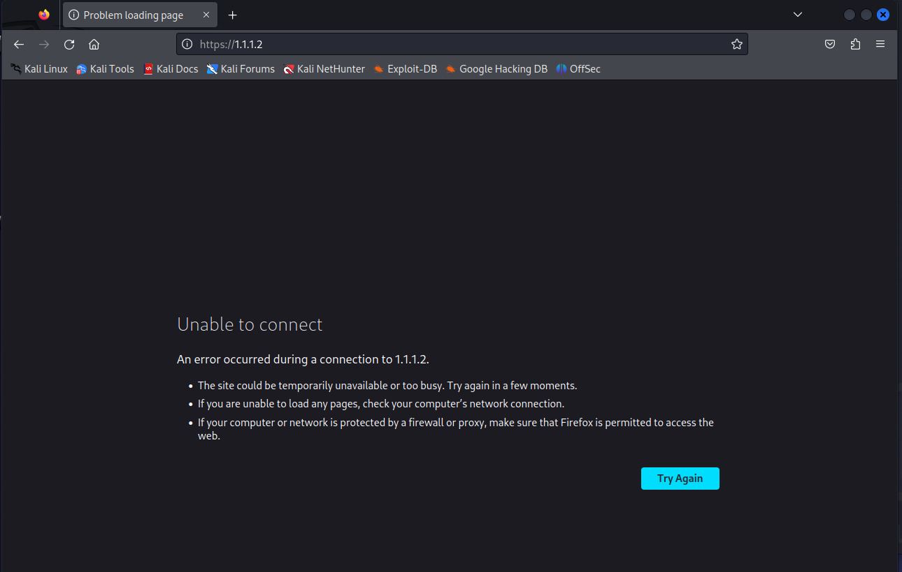	

​	接下来，攻击者开启SSH本地端口转发，建立隧道：

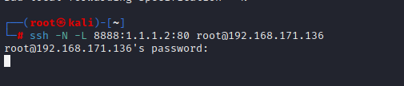

​	在输入服务器1的SSH密码之后，本地端口转发开启，此时我们再ping以下1.1.1.2

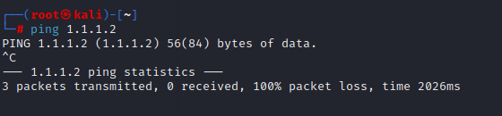

​	依然ping不通。接着我们在浏览器中访问一下1.1.1.2的web服务。由于开启了端口转发，所以我们要访问的不是1.1.1.2:80，而是访问本地的等待转发数据的端口：`127.0.0.1:8888`

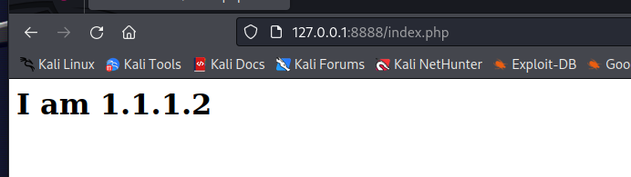

​	这次成功访问到了服务器2的web服务。接下来抓包看看整个通信过程：

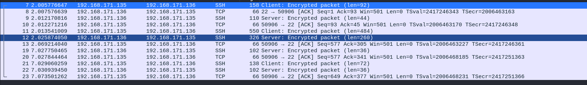

​	可以看到，整个访问web服务器的通信过程被封装在SSH协议中，通信内容被加密。并且，从五元组来看，看不到真正的目标IP。这个就是本地端口转发的过程：攻击者先将自己的流量转发到本地开启的等待转发数据的端口，然后由该端口通过SSH隧道将流量转发到中转服务器，最后由中转服务器将流量转发到目标服务器。这个也可以认为是代理技术的一种，代理技术通过多次流量转发，改变了最初的源目IP和端口从而达到了隐藏真实IP的目的，这个后面还会讲到。

#### 远程端口转发

​	SSH隧道技术中的本地端口转发（正向端口转发）和远程端口转发（反向端口转发）实现了数据流量的转发机制，但方向相反。本地端口转发通过将本地机器上的指定端口的数据流量转发到通过SSH隧道连接到的远程机器上的某个端口，从而实现跨网络访问。在这个过程中，SSH隧道的建立是由客户端主动发起的，即正向地从客户端向远程服务器建立连接。因此，本地端口转发也被称为正向端口转发。

​	相比之下，远程端口转发（或反向端口转发）涉及在远程机器（通常是跳板机）上开放一个端口，并通过SSH隧道将该端口的数据流量转发到服务端（SSH客户端所在机器）的指定端口上。这个过程首先建立SSH隧道，然后等待外部客户端的连接请求。由于隧道是从远程端回向本地端建立的，这个机制因此被称为反向端口转发。

​	还是考虑一个场景：

```txt
客户端：IP：192.168.171.135

跳板服务器：IP1：192.168.171.136	IP2：1.1.1.1

内网服务器：IP：1.1.1.2 Port：80
```

​	假如客户端希望能访问到内网服务器的web服务，但是这次使用远程端口转发。

​	首先介绍一下SSH远程端口转发的基本命令

```bash
ssh -N -R :8888:1.1.1.2:80 root@1.1.1.1

# -N表示不开启Shell连接
# -R表示远程端口转发
# : 表示接收所有IP地址连接
# 8888为跳板服务器监听端口
# 1.1.1.2:80为等待连接的本地IP及端口
# root@1.1.1.1为用于建立连接的中转服务器
ssh -N -R <远程端口>:<本地IP>:<本地服务端口> <SSH用户名>@<跳板服务器>
```

​	注意，要使用远程端口转发需要在跳板机上修改SSH服务的配置文件

```bash
vim /etc/ssh/sshd_config

# AllowTcpForwarding yes
# GatewayPorts yes
将这两项的注释去掉，确保后面的值是yes
```

​	下面看效果：

​	首先我们在客户端直接访问`http://1.1.1.2:80`：


​	肯定是无法访问的，都不在同一网段。接下来我们在服务器上开启远程端口转发：

> 注意！是在服务器1.1.1.2上运行命令`ssh -N -R :8888:1.1.1.2:80 root@1.1.1.1`

​	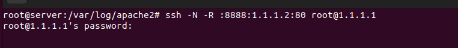

​	开启之后，我们再查看一下跳板机上的监听情况：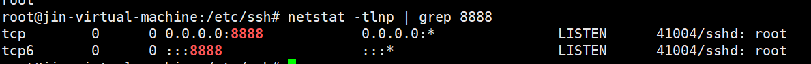

​	可以看到此时跳板机上已经开启了监听，此时我们再访问一下1.1.1.2上的web服务，注意此时输入的地址应该是跳板机上监听的IP和端口：


​	可以看到，成功连接上服务器的web服务。

​	同样抓包看看数据流量，首先是在客户端上抓包：

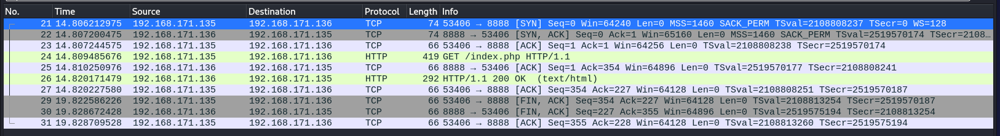

​	通过抓包观察可以发现，在客户端的视角中，其通信似乎始终只与跳板机进行，而真正的服务器地址和端口信息被隐蔽。这一现象揭示了使用远程端口转发不仅仅是为了跨越网络边界，更在于其对内网服务器的真实信息提供了一层保护，使得服务器的具体位置和身份对外部不可见。因此，在这种配置下，跳板机不仅仅扮演了网络跳板的角色，更升级为一个堡垒机，它为内网服务器提供了一重额外的安全防护，防止潜在的网络攻击者直接识别和访问内部资源。通过这种方式，远程端口转发成为了一种有效的内网安全策略，强化了网络的防御能力。

​	再在跳板机上抓包看一下，首先抓网卡192.168.171.136上面的包：

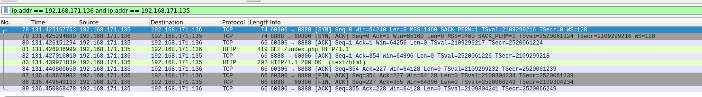

​	这个和在客户端上抓到的包几乎一样，毕竟是一次你来我往的通信过程，接着抓1.1.1.1上的包：

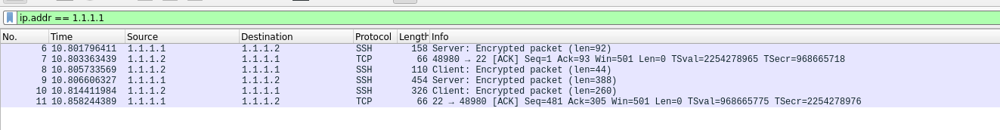

​	通过抓1.1.1.1上的包可以看到，真正建立SSH隧道的是1.1.1.1和1.1.1.2，这也符合我们运行的SSH远程端口转发命令。

​	通过上述两个实验，我们可以发现，SSH端口转发简单且强大，并且由于使用SSH协议，会对隧道内的数据进行加密，使得建立隧道的双方的通信变得相当安全。

#### 动态端口转发

​	与前面两种端口转发方法不同，动态端口转发允许用户直接创建一个SOCKS代理服务器，通过SSH客户端动态地将请求转发到多个远程服务器。这种方式非常灵活，因为它不需要预先指定目标地址和端口，用户可以通过配置SOCKS代理来动态地决定流量的目的地。

​	

### 2、ICMP隧道


### 3、DNS隧道


## 二、端口转发技术


## 三、代理服务器技术


## 四、行业黑话


## 五、总结
