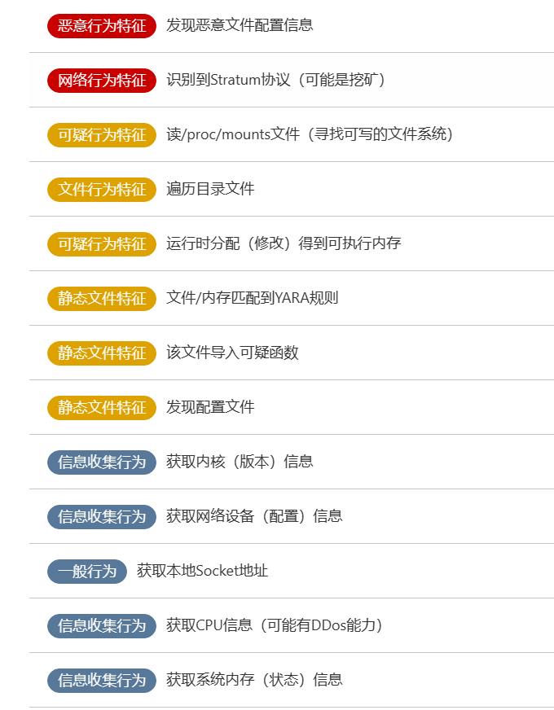

# 记一次服务器被攻击以及修复的全过程

​	**2023年12月19日，当我醒来开开心心准备上早八时，阿里云给我发来一条短信，告诉我我的云服务器涉嫌违规挖矿，责令我一周内整改，不整改就关停我的服务。不得不说，这则消息，比咖啡还提神。我立刻意识到，如果处理的好，这将是一次宝贵的经验。**

### 第一步、信息收集

​	阿里云那边给了很详细的事件分析，从文件目录到执行用户都给出来了。

​	看起来是web服务器用户，这个也是意料之中的，因为我的服务器开启了web服务，并且由于本人心大，实际的服务其实相当草率，有漏洞也不稀奇，毕竟我之前自己就修复过一个SQL注入的漏洞。奇怪就奇怪在tmp目录，tmp目录是个临时文件目录，在服务器中，由于要执行一些临时文件，web服务器需要有一个可以写入的目录，tmp目录也就是这个作用。

​	继续查看发现了另一个问题，我的云服务器部署了dvwa靶场，考虑到靶场自带漏洞，比较危险，所以将其放在了容器里面，没想到的是，放容器里面黑客也不放过，同样也被攻击了。

​	这个更夸张，直接拿到了容器内root权限。继续查看阿里云的沙箱检测，这里给了更详细的过程

​	从信息收集，到导入函数，遍历可写目录，然后加载程序，注入进程，一套组合拳，打的我是一脸懵逼。然后是TCP通信，我猜测应该是webshell以及传输数据。阿里云分析该进程是挖矿进程，那这边传输的应该就是挖矿相关的数据

​	接下来阅读ATT&CK矩阵。MITRE ATT&CK（Adversarial Tactics, Techniques, and Common Knowledge）矩阵是一个全面的知识库，用于描述和分类网络攻击的策略、技术和程序。它是网络安全领域的重要资源，被安全专业人员用于攻击检测、防御策略制定和安全意识提升。

​	可以看到攻击流程已经被保存下来了，就在我准备登录进系统，进一步查找问题的时候，麻烦来了

​	登陆失败了（吃一堑长一智，关键信息必须打码）。这个是后我去查看控制台，惊讶的发现，CPU的使用率突然变得奇高无比，我猜测应该是挖矿程序开始启动了。

​	那完蛋了，登录不进去，这只能重启服务器了，重启服务器我又怕这个恶意进程逃逸了，到时候找不到特征，就找不到黑客留下的webshell，倒时候就真只能重置服务器了，虽然服务器里面没什么数据，但是我不甘心就放过这次这么好的实践机会。但是不重启就没办法登录，真是个两难的问题。没办法最后选择了重启。

果然，重启之后，恶意进程被关闭了，我猜测应该是跟tmp目录是临时目录有关，也说不准。但是特征是没了。从昨晚八点到今天中午十二点，CPU占用率居高不下，重启一下CPU占用率就下来了，SSH也可以正常登陆了。网站服务也恢复正常。

​	看样子好像形势一片大好，攻击被拦截了。其实，真正的问题现在才显现出来。因为恶意进程被终止并不意味着攻击停止或消失，它往往会留下webshell，然后蛰伏起来。况且人家能够打进来一次，就能有第二次第三次和无数次，解决完webshell之后，还要对系统进行加固，我打算部署Snort和Hfish。

### 二、搜查系统

​	进入服务器查看top命令，一般不跑大型服务，CPU占用率都非常低，我的网站就是一个简单的登录界面加一个简单到不能再简单的网站导航界面，所以不可能会有很高的占用率

​	其实看阿里云的控制台就知道，在我重启了服务器之后，CPU占用率已经下来了，这个时候进入系统查看top其实大概率看不到现象。果然，我查看top发现占用率排名第一的是阿里云盾，真是讽刺，阿里云盾啊，你吃了我最多的资源，怎么没把攻击给我拦截下来了呢！其实在写文档的之前我登录到系统去看过，那个时候top1的是一个corn进程，占用率高达170%，我是双核CPU，所以170%意味着两个core基本都跑满了。然后我尝试了访问了一下web服务，系统就爆了，我就登陆不进去服务器了。

​	

​	原本的top1长这样，这是一个web用户创建的进程，，占用率高达175.8% 运行了1657个小时，是小时哦！接近七十天。但是根据阿里云的报告来看，显然不应该。如果恶意程序运行了七十天我还没发现，那我的服务器早被阿里云干掉了，所以我猜测，这个恶意进程是将自己注入到一个web服务的正常进程中执行，且根据cron来看，很有可能是一个定时进程。

​	没办法，重启服务器后，特征也消失了，现在只能痛苦的排查日志了。首先查看web日志，如果是web用户，那大概率是从web服务进来的。cd到/var/log目录下面好好看看怎么回事。我显示查看了SSH的auth.log文件，好家伙，将近10万条数据！暴力破解？

​	

​	进去看看，大量相同的拒绝连接，从不同的IP发来的攻击。

​	我这小小的服务器，何德何能啊，这ssh的序号都快给我干到一百万了，再看看web服务器的日志，就在笔者写这篇文档的时候，攻击还在继续，SSH爆破没有停，web扫描也没有停。先看看报错error.log

​	看得出来，有人视图用脚本查看我的目录里的敏感文件，比如admin.php，password.php之类的。甚至还扫描了wordpress，不过我目录里没有这些文件，所以报错了。其他没啥有用的数据，这个IP想都不用想，肯定挂了梯子。查了一下，果然，来自三哥

​	看的出来，三哥很闲。有这心思，怎么不考虑修一修自家的航母呢，真是无语！error.log的数据不多，这边看完就去看看access.log，看看怎么回事

​	由于重启了服务器，原本的日志丢失了，但是令我没想到的是，居然还有狗，还在嗅探，还准备攻击我，这个103.134.58.7，多次试图访问敏感目录。

​	好好好，孟加拉。就那个穷的电脑都没几台的国家，跑来攻击我？我肯定是不信的，这应该跟那个印度的那个一样，国内的狗东西挂了VPN，挂到了孟加拉。

​	我原本想要攻击溯源，但是重启系统后发现原本的日志丢失了，还有恶意程序逃逸了，自我删除。但是我担心这边留了webshell，大概率应该是留了，这种情况没办法，我目前要自己排查还不太可能，所以只能重置系统了。重置系统后想想怎么保留原本的靶场功能的情况下加固系统吧。

​	再继续看看我的网站文件，在common.php文件里面，我发现了一很恐怖的事，common.php是我网站的一个公用方法，里面定义了数据库相关的操作，之前没注意，这个文件是所有用户可读，而这个文件里面明文大字写下了我的MYSQL数据库的账号和密码，更关键的是这个我几乎所有！微信，qq，甚至支付宝账户用的都是这个密码，卧槽，看到这儿我后背发凉了，根据前面阿里云的报告来看，在主系统，黑客只拿到了web用户权限，但是web用户就已经可以读这个文件了，等于说，这个密码黑客已经拿到手了？？？

​	这个太恐怖了，这个密码离我的SSH用户密码就差两个字母，有没有可能黑客已经爆破出来了。越想越可怕了，于是紧急避险，我把除了22号端口外的所有端口都关了，这样数据就没办法进出。然后继续搜查系统。

​	紧接着我就发现一个很有意思的事，阿里云报告的文件目录都消失了，恶意程序就像一阵烟，在我重启系统后消散的无影无踪。在查询了阿里云那边的记录之后，我又发现了个更离奇的事。在我最开始登录服务器的时候，虽然恶意程序的CPU占用率很高，但是我还是登录进去了，等到我一访问web站点，我SSH直接下线，再登录就登录不上了，而阿里云那边记录的是，有第三方程序，阻止了SSH登录。这就离谱了，也就是说，除了挖矿程序，还有一个恶意程序，这个程序守护挖矿程序，如果发现SSH登录就拦截。这就逼得你不得不重启系统，而一旦重启系统，恶意程序就会自我删除，并且删除一切相关的数据，包括日志，让你无从查起。这我还能说啥，我只能说，牛逼。

​	总的来说，现在系统恢复正常，没有问题，但是肯定是被留过webshell的，他已经不安全了。就我现在的水平，我连人家怎么进来的都不知道，更别说找到webshell了。至此，系统搜查告一段落，不能说一无所获吧，只能说收获很少很少。只能是重置系统，然后想想怎么加固了。