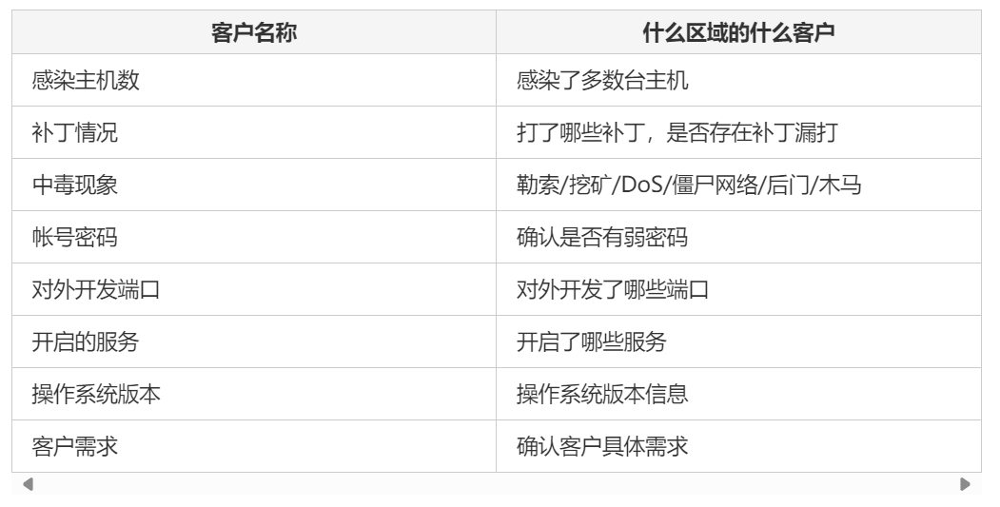

# Linux应急响应


## 整体思路：

+ 1、信息收集：收集客户信息和中毒主机信息，了解受影响面具体有哪些（攻击之前）

+ 2、确定攻击行为：要确定攻击是真实发生，不是正常业务流量误触。
+ 3、阻断攻击行为：确实攻击真实发生之后，就要及时阻断攻击，及时止损。
+ 4、清理系统提取样本：阻断攻击之后要及时搜查整个系统，找到黑客攻击留下的所有数据，包括流量数据，日志数据，病毒样本，恶意文件，后门账户，定时任务，恶意服务，iptables恶意规则，系统恶意进程、内存、启动项等等。要提取关键的日志文件或黑客信息，为后面研判溯源做准备。
+ 5、对攻击行为进行复测：清除系统中的恶意数据之后，对黑客攻击进行复测，确定漏洞真实性以及其存在的位置，为后面加固做准备。
+ 6、漏洞加固：对薄弱项及时加固，对被攻击主机加强监控，确保不会再被攻击。
+ 7、提交报告：将攻击流程，复测结果，漏洞位置，加固意见，病毒样本等写成报告提交。


##  一、信息收集



​	主要收集上图信息，了解攻击范围，以及攻击严重程度。了解上述信息能够帮助我们后面更好的有针对性的应急。


## 二、确定攻击行为

​	通过查看态感设备，或者其他防御设备中的告警信息，判断是否是真实攻击行为，而不是正常业务流量误报。判断攻击行为主要看，源目IP地址，访问的服务的端口号，站点信息、系统信息，攻击者的payload，有多少资产受到影响，服务器的回显如何。

​	可以查看态感设备的流量告警，日志告警，分析源目IP、payload特征等，判断攻击类型，具体是何种攻击行为：SQL注入、文件上传、RCE、反序列化、勒索、挖矿、DOS、Webshell上传等。

​	对于SQL注入、文件上传、DOS，反序列化，RCE这些攻击，流量特征较为明显。对于挖矿流量、C2服务器流量、CS、MSF木马、隧道流量、DNSLog等流量比较隐蔽，下面详讲：

###	（一）挖矿行为：

​	挖矿行为会产生大量的外联流量，这是因为挖矿程序需要向矿池提交挖矿的数据，因此挖矿程序会外联矿池。

​	挖矿产生的数据最后以JSON的数据类型传递到矿池，因此挖矿的报文流量会呈现大量的流量封装类似、内容类似且外联矿池等特征。一般通过判断报文中是否存在Json字符串，且是否存在特殊字符`XMRig/5.1.0`等挖矿程序版本内容，来判断是否为挖矿流量。接着锁定矿池的IP地址，再根据IP地址反查矿池的域名。

​	目前，互联网中绝大部分挖矿行为都是针对门罗币（XMR）这一虚拟货币，这是因为门罗币具有匿名性，且支持CPU挖矿，价值较高等特点。因此，挖矿木马的首选就是门罗币。针对个人攻击，挖矿木马主要采用矿池挖矿，即根据每个人的贡献值进行奖励结算，因此会有矿池地址和钱包地址。目前公开提供的门罗币挖矿程序有：`XMR-stak`、`xmrig`、`claymore`等.

#### 流量特征

​	以XMR-Stak为例。

​	在初次运行XMR-Stak的时候，会输入矿池地址、钱包地址等必要参数生成配置文件，然后XMR-Stak根据配置文件中的矿池地址连接矿池。与矿池建立连接后程序会发送一个登录请求，然后矿池会返回一个工作任务给矿工。

​	XMR-Stak的登录请求报文中，JSON数据如下：

```json
{"method":"login","params":{"login":"xxxxxxx","pass":"xxx","rigid":"","agent":"xxxxxx"},"id":1}
{"method":"submit","params":{"id":"xx","job_id":"xxxxxx","nonce":"xxxxx","result":"xxxxxx"},"id":1}
```

​	矿池会发送一个包含工作任务的JSON数据：

```JSON
{
  "id": 1,
  "jsonrpc": "2.0",
  "method": "job",
  "params": {
    "job_id": "1234",
    "target": "aabbccdd",
    "blob": "abcd1234..."
  }
}

```

​	然后矿工开始工作，工作完成之后矿工提交结果：

```json
{
  "id": 1,
  "jsonrpc": "2.0",
  "method": "submit",
  "params": {
    "id": "miner_id",
    "job_id": "1234",
    "nonce": "00000001",
    "result": "abcd1234..."
  }
}
```

​	整个过程以JSON数据在矿池与矿工之间传递。对于XMR-stak程序，若使用JSONRPC协议，则其报文中会有`"jsonrpc": "2.0"`这种JSONRPC的协议版本。

​	现在挖矿程序一般使用Stratum协议，这是一个专为挖矿程序设计的协议。协议特征为：在`"method"`属性中，会有`mining`对象名。

```JSON
{
  "id": 1,
  "method": "mining.subscribe",
  "params": []
}
```

​	对于这种挖矿流量，可以定义规则匹配关键字，例如`method` `params` `jsonrpc`等。

#### 系统特征

​	对于门罗币挖矿而言，由于其支持CPU挖矿，所以可以使用服务器来进行挖矿，因为大部分Linux服务器都只配置CPU而不配置GPU。

​	**特征一：CPU、GPU占用率飙升，系统卡顿**

​	挖矿需要调用大量的计算资源来进行哈希运算，因此所有的挖矿程序几乎都是将CPU或GPU的使用率提升到几乎爆满。因此会导致正常的系统操作和服务变得卡顿，例如导致无法SSH登录，无法进行正常的系统操作等。

​	这个特征可以使

用`top`、`ps`命令进行排查。对于服务器而言，CPU占用率最高的那个一般就是挖矿程序了。

​	**特征二：持久化，定时化**

​	挖矿是一个持久的过程，因此攻击者拿到服务器权限之后，一般会进行权限维持的操作。例如创建定时、计划任务，创建服务，或者设置自启动项等操作。

​	检查定时、计划任务可以使用如下命令：

```bash
# 排查系统级别的定时任务
cat /etc/crontab
ls /etc/cron.*

# 排查用户级别的定时任务
for user in $(cut -f1 -d: /etc/passwd); do crontab -u $user -l; done

# 查看当前用户的定时任务
crontab -l

# 查看其他用户的定时任务
sudo crontab -u <username> -l

# 使用find命令找crontab文件
sudo find / -type f -name 'cron*' 2>/dev/null

# 检查cron日志
sudo cat /var/log/cron
sudo cat /var/log/syslog | grep cron

# 检查计划任务（at jobs）
atq
at -c <job_id>

# 列出所有计划任务
sudo ls /var/spool/cron/atjobs
```

​	检查服务项或网络连接：

```bash
# 使用systemctl列出所有正在运行的任务
systemctl list-units --type=service

# 查看所有已安装的服务配置文件
ls /etc/systemd/system/
ls /lib/systemd/system/

# 使用service命令
service --status-all

# 排查网络连接
netstat -antup
ss -autup
lsof -i
```

​	检查自启动项：


### （二）C2服务器流量特征

​	C2服务器（Command and Control Server），即命令和控制服务器，是攻击者用于下发命令或操作的攻击服务器。一般C2服务器使用的远控软件多为CS，MSF等。其中MSF适合单兵作战，而CS多用于针对Windows的团队协作攻击。

​	首先关注CS的流量特征，一般来说，CS的攻击过程为首先生成一个payload，再由攻击者对payload进行免杀处理，以各种形式将恶意文件上传到被攻击者的主机上，再运行该恶意软件，与C2服务器进行连接。


